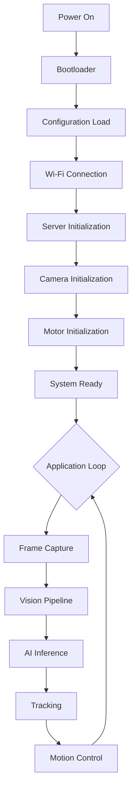

# SmartCam Platform — Introduction

## Objective

Define the scope, goals, and philosophy of the SmartCam Platform, an embedded computer vision operating system for the ESP32-S3 architecture.

## Scope

This document covers the general vision, hardware platform, target applications, and high-level organization of the SmartCam Platform. It serves as the entry point for all subsequent technical documentation.

## Architecture

The SmartCam Platform is composed of five primary layers:

```text
Applications (SmartCam Apps)
    |
Behavior Engine
    |
Core Services (Engines)
    |
SmartCam SDK
    |
Hardware Abstraction Layer (HAL)
    |
ESP32-S3 Physical Layer
```

## Components

| Component | Description |
|-----------|-------------|
| SmartCam OS | Embedded firmware running on ESP32-S3 |
| SmartCam Core | Kernel services, engines, and infrastructure |
| SmartCam SDK | Software development kit for building applications |
| SmartCam Dashboard | Web-based user interface |
| SmartCam Apps | Application layer (Person Tracker, GeoFissura, etc.) |
| SmartCam Hardware Reference | Official hardware specification and electrical design |

## Fluxos



## Interfaces

The platform exposes the following interfaces:

- REST API (`/api/v1/`) for configuration and control
- WebSocket (`/ws`) for real-time events and telemetry
- MJPEG Stream for live video feed
- SmartCamApp C++ interface for application development

## Estrutura de Pastas

```text
smartcam-os/
    docs/               Official documentation
    firmware/           SmartCam OS firmware (Arduino IDE)
    sdk/                SmartCam SDK source and headers
    web/                Dashboard HTML/CSS/JavaScript
    hardware/           Electrical schematics and pinouts
    cad/                3D mechanical models (STL/STEP)
    examples/           Example applications
    tests/              Test suites
    tools/              Development utilities
    scripts/            Build and release automation
    assets/             Logos, screenshots, media
```

## Responsabilidades

| Layer | Responsibility |
|-------|----------------|
| SmartCam OS | Firmware lifecycle, task scheduling, hardware access |
| SmartCam Core | Camera, Vision, Motion, AI, Tracking, Network, Storage, Logger |
| SmartCam SDK | Application framework, event bus, configuration manager |
| SmartCam Dashboard | User interface, real-time monitoring, configuration |
| SmartCam Apps | Domain-specific business logic |
| SmartCam Hardware Reference | Physical hardware specification |

## Requisitos

| ID | Requirement |
|----|-------------|
| REQ-001 | Platform operates on LilyGO T-SIMCAM ESP32-S3 |
| REQ-002 | All configuration is performed via web interface — no firmware recompilation required |
| REQ-003 | System supports 24/7 continuous operation |
| REQ-004 | Architecture is modular with low coupling between components |
| REQ-005 | All inter-module communication occurs through the Event Bus |
| REQ-006 | Firmware is compiled with Arduino IDE 2.x |
| REQ-007 | Application development does not require GPIO or hardware knowledge |
| REQ-008 | System supports OTA firmware updates |
| REQ-009 | Configuration is centralized in a Configuration Manager |
| REQ-010 | All measurements are configurable and persist across reboots |

## Considerações

The platform is designed for evolution across multiple hardware generations. The initial target is a single-axis PTZ configuration (Pan only), with architecture provisions for Tilt, Zoom, Focus, and linear axes. Application code is isolated from hardware through the SDK layer, ensuring future hardware upgrades do not require rewriting application logic.

The SmartCam Platform is not a single-purpose firmware — it is a reusable operating system for embedded computer vision.

## Próximos documentos relacionados

- [02-system-architecture.md](02-system-architecture.md) — System architecture and design principles
- [03-core-architecture.md](03-core-architecture.md) — SmartCam Core internals
- [16-hardware-reference.md](16-hardware-reference.md) — Hardware specification and pinout
