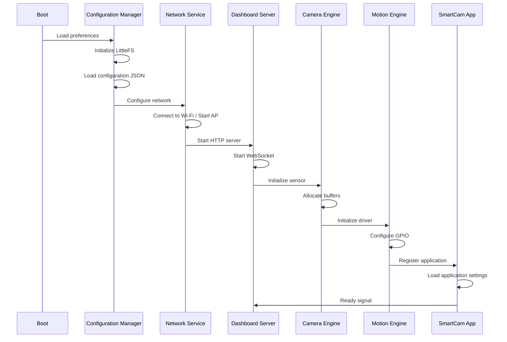

# SmartCam Platform — System Architecture

## Objective

Define the overall system architecture, layer organization, communication patterns, and design principles governing the SmartCam Platform.

## Scope

This document describes the logical and physical architecture of the entire platform. It covers the layered structure, inter-module communication, event system, and task distribution across the ESP32-S3 dual-core processor.

## Architecture

```mermaid
flowchart TD
    subgraph Apps [SmartCam Apps]
        PT[Person Tracker]
        GF[GeoFissura]
        SC[Scanner]
        IC[Inspection]
        TL[TimeLapse]
    end

    subgraph BE [Behavior Engine]
        BEC[Behavior Controller]
    end

    subgraph SDK [SmartCam SDK]
        SApp[SmartCamApp Interface]
        SEvent[Event Bus]
        SConfig[Configuration Manager]
        SLogger[Logger Service]
    end

    subgraph Core [SmartCam Core Engines]
        CE[Camera Engine]
        VE[Vision Engine]
        AIE[AI Engine]
        TTE[Tracking Engine]
        MCE[Motion Engine]
    end

    subgraph Infra [Infrastructure Services]
        NET[Network Service]
        STR[Storage Service]
        API[API Service]
        OTA[OTA Service]
        DSH[Dashboard Server]
    end

    subgraph HAL [Hardware Abstraction Layer]
        GPIO[GPIO]
        TIM[Timers]
        I2C[I2C/SPI/UART]
        CAM[Camera Driver]
    end

    subgraph HW [ESP32-S3 Hardware]
        CPU0[Core 0 - Services]
        CPU1[Core 1 - Real-Time]
        PSRAM[PSRAM 8MB]
        FLASH[Flash 16MB]
    end

    Apps --> BE
    BE --> SDK
    SDK --> Core
    Core --> Infra
    Infra --> HAL
    HAL --> HW
```



## Components

### Layer 0 — Hardware Abstraction Layer (HAL)

Provides abstraction for all physical peripherals: GPIO, timers, I2C, SPI, UART, PWM, and camera driver. No module above this layer accesses hardware directly.

### Layer 1 — Infrastructure Services

| Service | Responsibility |
|---------|---------------|
| Network Service | Wi-Fi station/AP, scan, reconnect |
| Storage Service | LittleFS file operations, NVS preferences |
| API Service | REST endpoint routing and response formatting |
| OTA Service | Firmware update via HTTP |
| Dashboard Server | Serves web interface files |

### Layer 2 — Core Engines

| Engine | Responsibility |
|--------|---------------|
| Camera Engine | Frame capture, MJPEG streaming, sensor configuration |
| Vision Engine | Image processing pipeline, filters, blob detection, measurement |
| AI Engine | Model inference and object detection (Inference + Detection) |
| Tracking Engine | Target selection, PID control, search strategies |
| Motion Engine | Axis motion planning, queue, pulse generation |

### Layer 3 — SmartCam SDK

Provides the application development framework: `SmartCamApp` base class, `Event Bus` for decoupled communication, `Configuration Manager` for centralized settings, and `Logger` for structured logging.

### Layer 4 — Behavior Engine

Orchestrates the application flow by coordinating engines according to the active application profile.

### Layer 5 — SmartCam Apps

Domain-specific applications implementing the `SmartCamApp` interface.

## Fluxos

### System Initialization Flow



### Core Affinity

| Core | Assigned Tasks |
|------|---------------|
| Core 0 (Services) | Wi-Fi, HTTP, WebSocket, OTA, API, Dashboard |
| Core 1 (Real-Time) | Camera capture, AI inference, Tracking, PID, Motion control |

## Interfaces

### Event Bus

All modules communicate through the Event Bus. No module calls another directly.

```cpp
enum class EventType {
    CAMERA_READY,
    FRAME_READY,
    TARGET_LOCKED,
    TARGET_LOST,
    MOTION_STOPPED,
    WIFI_CONNECTED,
    OTA_STARTED,
    ERROR_OCCURRED
};
```

### Message Structure

```cpp
struct Message {
    uint32_t id;
    uint32_t timestamp;
    EventType event;
    void* data;
};
```

## Estrutura de Pastas

```text
firmware/
    SmartCamOS.ino
    core/
        camera/          Camera Engine
        vision/          Vision Engine
        tracking/        Tracking Engine
        motion/          Motion Engine
        ai/              AI Engine
    network/             Network Service
    storage/             Storage Service
    logger/              Logger Service
    dashboard/           Dashboard Server
    api/                 API Service
    config/              Configuration Manager
    utils/               Utilities and helpers
```

## Responsabilidades

| Module | Responsibility |
|--------|---------------|
| SmartCamOS.ino | Entry point, setup(), loop(), task creation |
| Core Engines | Domain-specific processing pipelines |
| Infrastructure | System services (network, storage, API) |
| Configuration | Centralized settings management |
| SDK | Application framework and interfaces |

## Requisitos

| ID | Requirement |
|----|-------------|
| ARC-001 | No module accesses hardware directly — always through HAL |
| ARC-002 | All modules communicate via Event Bus |
| ARC-003 | System state is defined by a finite state machine |
| ARC-004 | Tasks are distributed across both cores by affinity |
| ARC-005 | Memory allocation is static — no runtime `malloc` in critical paths |
| ARC-006 | Watchdog monitors all tasks with automatic recovery |
| ARC-007 | Logger is the only module that writes to serial output |
| ARC-008 | Each module has its own configuration schema |

## Considerações

The architecture follows a microkernel-inspired design. The core remains minimal while services and applications are added as independent modules. This approach ensures long-term maintainability and allows the platform to scale from simple tracking to complex multi-axis inspection systems without fundamental restructuring.

## Próximos documentos relacionados

- [03-core-architecture.md](03-core-architecture.md) — Task scheduling and state machines
- [10-sdk-framework.md](10-sdk-framework.md) — SmartCam SDK and application framework
