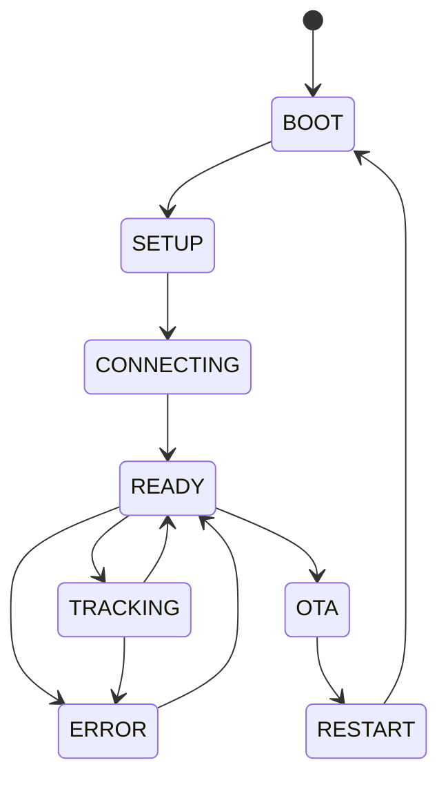
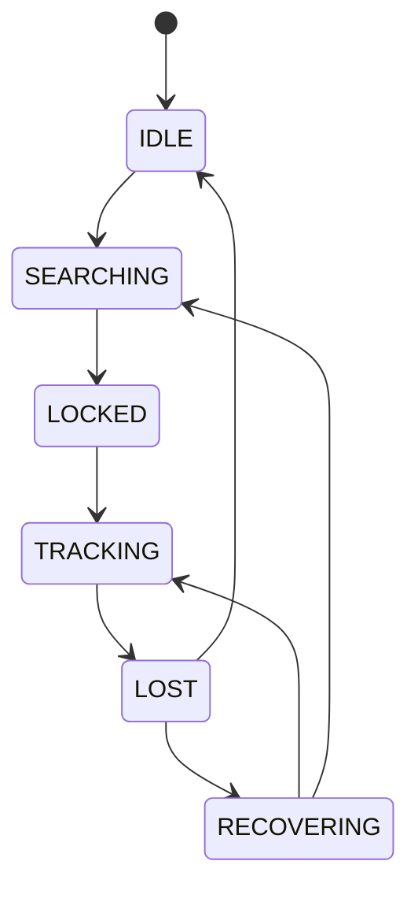
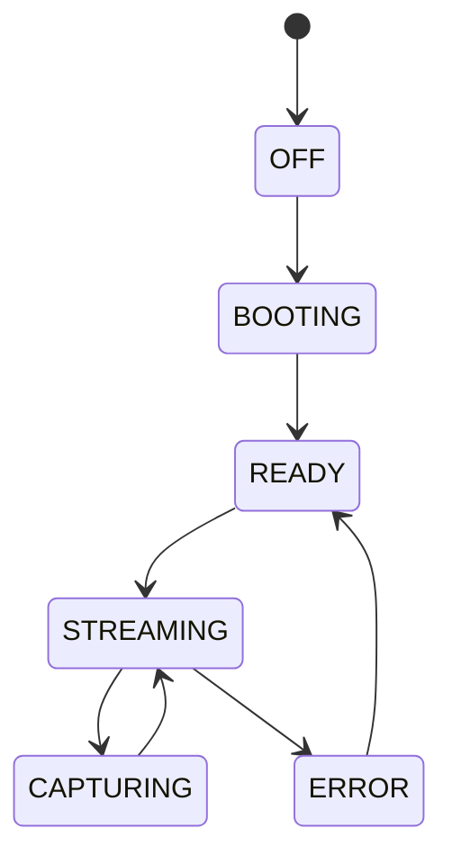
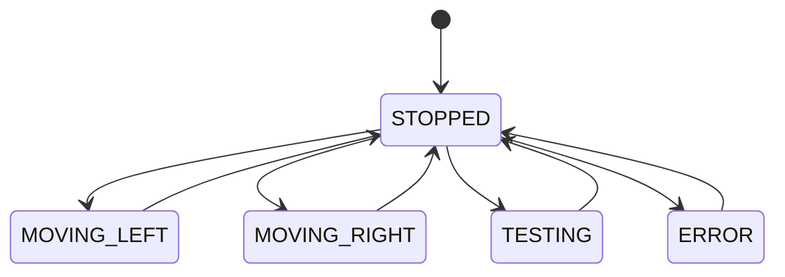
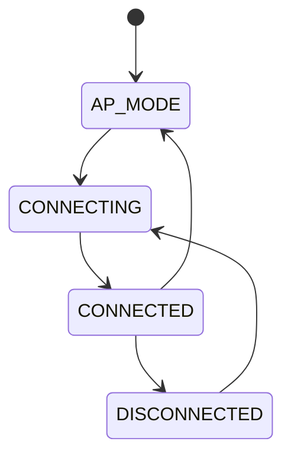

# SmartCam Platform — Core Architecture

## Objective

Define the internals of the SmartCam Core: task scheduling, state machines, memory management, watchdog strategy, and initialization sequence.

## Scope

This document covers the FreeRTOS task distribution, system states, error handling, and lifecycle management of the SmartCam OS firmware running on the ESP32-S3.

## Architecture

```mermaid
flowchart TD
    subgraph Init [Initialization Sequence]
        A[Power On] --> B[Clock Configuration]
        B --> C[Serial Init]
        C --> D[Load Preferences]
        D --> E[Initialize LittleFS]
        E --> F[Load Config JSON]
        F --> G[Initialize GPIO]
        G --> H[Initialize LED]
        H --> I[Initialize Driver]
        I --> J[Initialize Motor]
        J --> K[Initialize Wi-Fi]
        K --> L[Initialize Web Server]
        L --> M[Initialize WebSocket]
        M --> N[Initialize OTA]
        N --> O[Initialize Camera]
        O --> P[Initialize AI]
        P --> Q[Create FreeRTOS Tasks]
        Q --> R[System Ready]
    end
```



## Components

### System State Machine



### Tracking State Machine



### Camera State Machine



### Motion State Machine



### Wi-Fi State Machine



## Fluxos

### Task Priority Table

| Task | Core | Priority | Period |
|------|------|----------|--------|
| Tracking | 1 | Highest | Frame-driven |
| Camera | 1 | Highest | Frame-driven |
| Motion | 1 | High | Event-driven |
| Dashboard | 0 | Medium | 250 ms |
| Wi-Fi | 0 | Medium | 500 ms |
| System Monitor | 0 | Medium | 1000 ms |
| Logger | 0 | Low | Event-driven |
| OTA | 0 | Low | Event-driven |

### Error Recovery Flow

```text
Error Detected
    |
    v
Log Error
    |
    v
Notify Dashboard (WebSocket event)
    |
    v
Attempt Recovery
    |
    v
[Success] --> Return to previous state
    |
[Failure] --> Safe Mode
    |
    v
Maintain Streaming
Maintain Dashboard
Disable Tracking
Disable Motor
```

## Interfaces

### Task Creation

```cpp
void createSystemTasks() {
    xTaskCreatePinnedToCore(taskCamera,   "camera",   4096, NULL, 3, NULL, 1);
    xTaskCreatePinnedToCore(taskTracking, "tracking", 8192, NULL, 3, NULL, 1);
    xTaskCreatePinnedToCore(taskMotion,   "motion",   4096, NULL, 2, NULL, 1);
    xTaskCreatePinnedToCore(taskWiFi,     "wifi",     4096, NULL, 1, NULL, 0);
    xTaskCreatePinnedToCore(taskDashboard,"dashboard",4096, NULL, 1, NULL, 0);
    xTaskCreatePinnedToCore(taskMonitor,  "monitor",  2048, NULL, 1, NULL, 0);
    xTaskCreatePinnedToCore(taskLogger,   "logger",   2048, NULL, 0, NULL, 0);
    xTaskCreatePinnedToCore(taskOTA,      "ota",      4096, NULL, 0, NULL, 0);
}
```

### Inter-Task Communication

```text
Tracking Task
    |
    | Queue
    v
Motion Task (receives move commands)
    |
    | Queue
    v
GPIO (STEP/DIR pulses)
```

### Result Enumeration

```cpp
enum class Result {
    Ok,
    Error,
    Timeout,
    InvalidParameter,
    Busy,
    NotInitialized,
    HardwareFailure
};
```

## Estrutura de Pastas

```text
firmware/
    SmartCamOS.ino          Entry point
    core/
        system/
            system.h        System health, uptime, info
            system.cpp
        watchdog/
            watchdog.h      Task monitoring and recovery
            watchdog.cpp
```

## Responsabilidades

| Component | Responsibility |
|-----------|----------------|
| SmartCamOS.ino | Initialization sequence, task creation, main loop |
| System Module | Health monitoring, uptime tracking, reboot control |
| Watchdog | Task liveness checks, automatic recovery |
| Safe Mode | Graceful degradation on critical failure |

## Requisitos

| ID | Requirement |
|----|-------------|
| CORE-001 | All tasks are created during initialization, never dynamically |
| CORE-002 | System state is published via WebSocket every 250 ms |
| CORE-003 | Memory allocation is static — buffers are pre-allocated |
| CORE-004 | `delay()` is never used in production code |
| CORE-005 | `Serial.println()` is never used — Logger service is used instead |
| CORE-006 | Watchdog timeout triggers task restart before system reset |
| CORE-007 | Safe Mode preserves streaming and dashboard access |
| CORE-008 | System must recover from transient camera failures without reboot |

## Considerações

The core architecture prioritizes stability over feature completeness. All tasks are designed to be preemptible and non-blocking. The watchdog system provides three levels of recovery: task restart, module reinitialization, and full system reboot. Memory fragmentation is minimized through pre-allocated frame buffers and object pools.

## Próximos documentos relacionados

- [02-system-architecture.md](02-system-architecture.md) — System architecture overview
- [04-camera-engine.md](04-camera-engine.md) — Camera Engine specification
- [05-motion-engine.md](05-motion-engine.md) — Motion Control Engine specification
