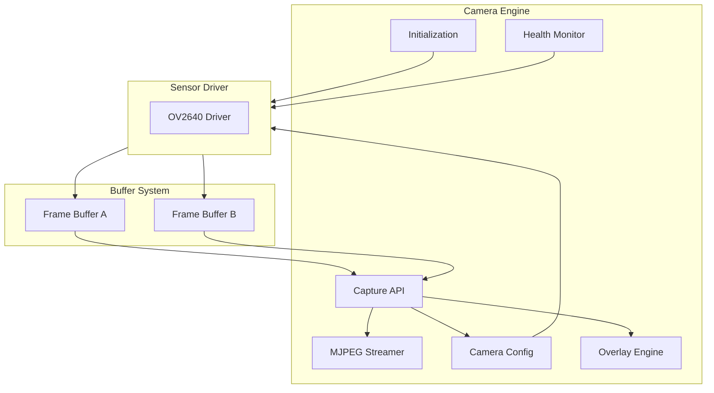
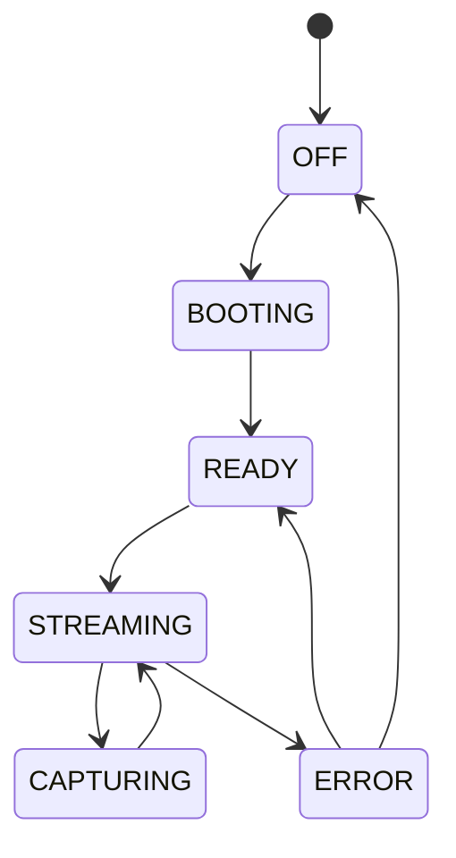
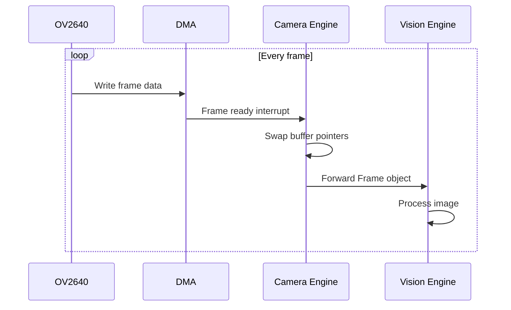

# SmartCam Platform — Camera Engine

## Objective

Define the Camera Engine responsible for sensor initialization, frame capture, MJPEG streaming, and real-time parameter configuration. No other module accesses the camera driver directly.

## Scope

This document covers the camera driver architecture, double-buffering strategy, resolution profiles, streaming pipeline, overlay system, and health monitoring.

## Architecture



## Components

### Camera States



### Double Buffer Architecture

```text
Buffer A: Being processed by Vision Engine
Buffer B: Being filled by camera sensor
    |
Next frame: swap pointers
```

## Fluxos

### Capture Pipeline



### Health Monitor Flow

```text
Frame timeout detected
    |
    v
Log error (CAM002)
    |
    v
Notify Dashboard via WebSocket
    |
    v
Reinitialize sensor driver
    |
    v
[Success] --> Return to STREAMING
    |
[Failure] --> Set state to ERROR
    |
    v
Retry after 5 seconds
```

## Interfaces

### Frame Structure

```cpp
struct Frame {
    uint16_t width;
    uint16_t height;
    uint8_t* buffer;
    uint32_t timestamp;
    size_t size;
};
```

### Capture API

```cpp
class CameraEngine {
public:
    Result begin();
    Result capture(Frame& frame);
    Result setResolution(const char* resolution);
    Result setQuality(uint8_t quality);
    Result setBrightness(int8_t value);
    Result setContrast(int8_t value);
    Result setSaturation(int8_t value);
    Result setMirror(bool enabled);
    Result setFlip(bool enabled);
    Result startStream();
    Result stopStream();
    Frame* getCurrentFrame();
    CameraStatus getStatus();
};
```

### Camera Configuration Schema

```json
{
    "resolution": "QVGA",
    "quality": 12,
    "brightness": 0,
    "contrast": 0,
    "saturation": 0,
    "mirror": false,
    "flip": false,
    "fps": 20,
    "aec": true,
    "agc": true,
    "awb": true
}
```

## Estrutura de Pastas

```text
firmware/
    core/
        camera/
            camera_engine.h
            camera_engine.cpp
            camera_driver.h
            camera_driver.cpp
            camera_stream.h
            camera_stream.cpp
            camera_capture.h
            camera_capture.cpp
            camera_settings.h
            camera_settings.cpp
            camera_buffers.h
            camera_buffers.cpp
```

## Responsabilidades

| Component | Responsibility |
|-----------|----------------|
| Camera Engine | Public API, state machine, buffer management |
| Camera Driver | Low-level sensor communication (OV2640) |
| Camera Stream | MJPEG streaming over HTTP |
| Camera Capture | Frame capture and buffer management |
| Camera Settings | Parameter validation and application |
| Camera Buffers | Double buffer allocation and swapping |

## Requisitos

| ID | Requirement |
|----|-------------|
| CAM-001 | Initialize OV2640 sensor within 5 seconds |
| CAM-002 | Support resolutions: QQVGA, QVGA, VGA, SVGA |
| CAM-003 | Maintain minimum 15 FPS at QVGA with AI processing |
| CAM-004 | All parameters configurable at runtime without restart |
| CAM-005 | Double buffering with zero-copy buffer swap |
| CAM-006 | Camera health monitor with automatic recovery |
| CAM-007 | MJPEG stream accessible via HTTP endpoint |
| CAM-008 | Snapshot capture with JPEG download |
| CAM-009 | Overlay engine for bounding boxes and telemetry |
| CAM-010 | Frame timestamp with sub-millisecond precision |

## Considerações

The Camera Engine is designed for hot-swappable sensor drivers. While the initial implementation targets OV2640, the architecture supports OV5640 and future sensors through the camera driver abstraction layer. The double-buffer design ensures the Vision Engine always has immediate access to the most recent complete frame without waiting for sensor DMA.

## Próximos documentos relacionados

- [06-vision-engine.md](06-vision-engine.md) — Vision processing pipeline
- [07-ai-engine.md](07-ai-engine.md) — AI inference and detection
- [16-hardware-reference.md](16-hardware-reference.md) — Camera pinout and electrical interface
