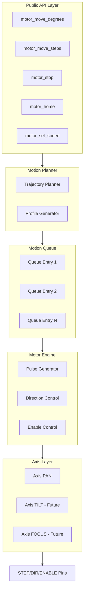
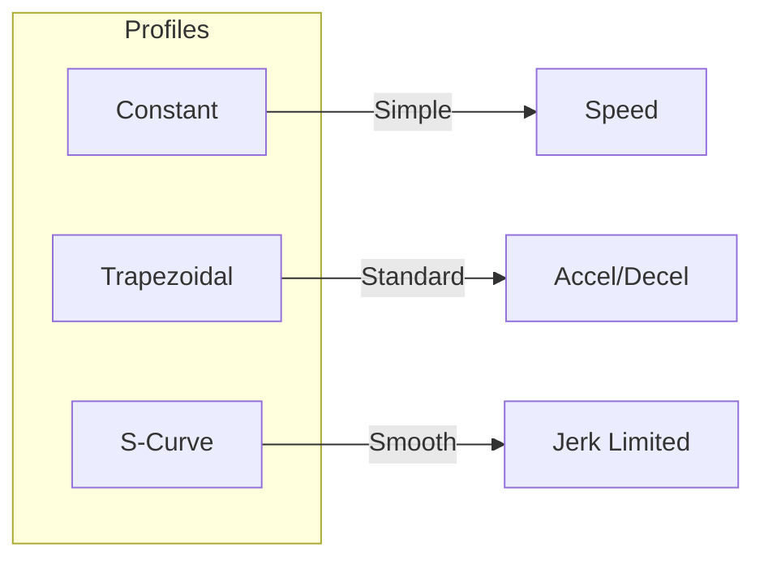
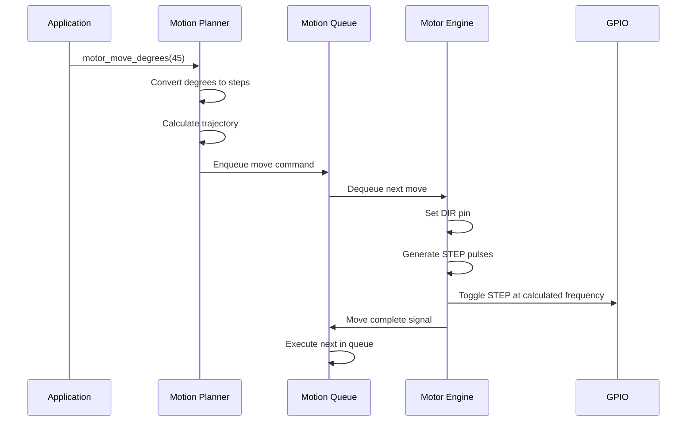

# SmartCam Platform — Motion Control Engine

## Objective

Define the Motion Control Engine (MCE) responsible for universal stepper motor control via STEP/DIR/ENABLE signals. The engine operates on an Axis abstraction, decoupling motion logic from specific motor or driver hardware.

## Scope

This document covers the Axis architecture, motion planning, trajectory profiles, pulse generation, homing sequence, soft limits, and the motion queue system.

## Architecture



## Components

### Axis Architecture

```text
Axis PAN (V1.0)
    Motor: NEMA 23
    Driver: DM556D
    Range: -180° to +180°
    Steps per revolution: 200 (configurable microstep)

Axis TILT (V2.0 - Planned)
Axis ZOOM (V3.0 - Planned)
Axis LINEAR (V3.0 - Planned for GeoFissura)
```

### Motion Profiles



## Fluxos

### Movement Execution



### Homing Sequence

```text
Start
    |
    v
Move toward sensor at slow speed
    |
    v
Sensor triggered?
    |   YES
    v
Stop immediately
    |
    v
Move back (release)
    |
    v
Move forward slowly
    |
    v
Sensor triggered?
    |   YES
    v
Set home_position = 0
    |
    v
Move to reference offset
    |
    v
Ready
```

### Pulse Generation

STEP pulses are generated via hardware timer, never `delayMicroseconds()`:

```text
Timer ISR fires at calculated frequency
    |
    v
Toggle STEP pin
    |
    v
Increment step counter
    |
    v
[Reached target] --> Stop timer
    |
[Not reached] --> Continue
```

## Interfaces

### Public API

```cpp
class MotionEngine {
public:
    Result begin();
    Result enable();
    Result disable();
    Result stop();
    Result home();

    Result moveSteps(int32_t steps);
    Result moveDegrees(float degrees);
    Result moveMillimeters(float mm);
    Result moveContinuous(Direction dir);

    Result setSpeed(float rpm);
    Result setAcceleration(float accel);
    Result setMicrostep(uint8_t microstep);
    Result setCurrent(float amps);

    bool isBusy();
    int64_t getPosition();
    int64_t getHomePosition();
    MotionStatus getStatus();
};
```

### Movement JSON API

```json
{
    "axis": "pan",
    "mode": "degree",
    "value": 35,
    "speed": 120,
    "acceleration": 300
}
```

### Axis Configuration

```json
{
    "axis": "pan",
    "steps_per_rev": 200,
    "microstep": 16,
    "max_speed": 300,
    "max_acceleration": 500,
    "soft_limit_left": -180,
    "soft_limit_right": 180,
    "reverse_dir": false,
    "idle_timeout": 5000
}
```

## Estrutura de Pastas

```text
firmware/
    core/
        motion/
            motion_engine.h
            motion_engine.cpp
            motion_planner.h
            motion_planner.cpp
            motion_queue.h
            motion_queue.cpp
            motion_pulse.h
            motion_pulse.cpp
            motion_axis.h
            motion_axis.cpp
            motion_homing.h
            motion_homing.cpp
            motion_config.h
            motion_config.cpp
```

## Responsabilidades

| Component | Responsibility |
|-----------|----------------|
| Motion Engine | Public API, state machine, axis management |
| Motion Planner | Degree/step conversion, trajectory calculation |
| Motion Queue | Command queuing and sequential execution |
| Motion Pulse | Hardware timer-based STEP generation |
| Motion Axis | Per-axis configuration and position tracking |
| Motion Homing | Sensor-based reference search |
| Motion Config | Parameter validation and limits enforcement |

## Requisitos

| ID | Requirement |
|----|-------------|
| MOT-001 | Support NEMA 17/23/24 stepper motors via DM556D driver |
| MOT-002 | Generate STEP pulses via hardware timer, not software delay |
| MOT-003 | Support trapezoidal and S-Curve velocity profiles |
| MOT-004 | Maintain position accuracy within ±1 step |
| MOT-005 | Enforce soft limits for all axes |
| MOT-006 | Support absolute, relative, and continuous movement modes |
| MOT-007 | Motion queue with minimum 16 entries |
| MOT-008 | Independent axis configuration per physical axis |
| MOT-009 | Idle timeout with automatic motor disable |
| MOT-010 | Home sequence with sensor input |

## Considerações

The Motion Control Engine is designed as a universal axis controller. V1.0 implements a single PAN axis, but the architecture supports up to 6 axes (PAN, TILT, FOCUS, ZOOM, LINEAR, ROTARY). Each axis maintains independent position tracking, limits, and configuration. The hardware timer-based pulse generation ensures consistent stepping frequency regardless of CPU load from camera processing or web server operations.

## Próximos documentos relacionados

- [08-tracking-engine.md](08-tracking-engine.md) — Target tracking and PID integration
- [16-hardware-reference.md](16-hardware-reference.md) — Motor driver GPIO and electrical wiring
- [13-configuration-manager.md](13-configuration-manager.md) — Axis profile storage
