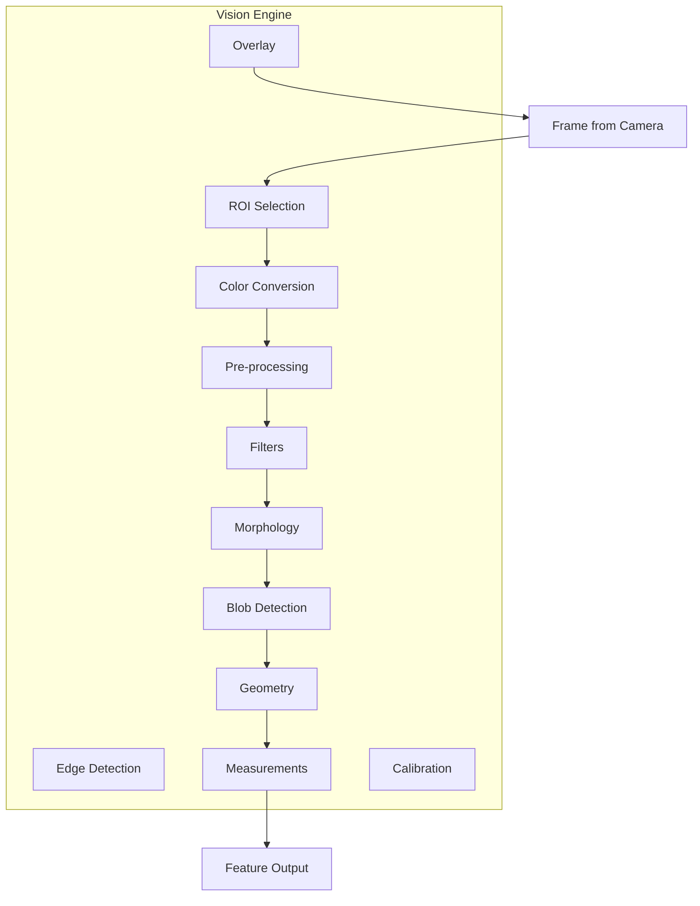
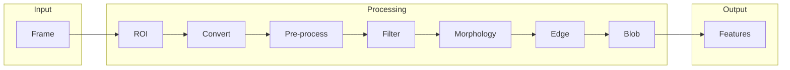

# SmartCam Platform — Vision Engine

## Objective

Define the Vision Engine (VE) responsible for all digital image processing within the SmartCam Platform. The engine operates on `Frame` objects and produces `Feature` structures consumed by the AI Engine and Tracking Engine.

## Scope

This document covers the image processing pipeline, color space conversion, filters, morphology, blob detection, edge detection, geometric measurements, calibration, and overlay rendering.

## Architecture



## Components

### Pipeline Stages



### Color Spaces

| Source | Conversion | Algorithm |
|--------|------------|-----------|
| RGB565 | Grayscale | Luminosity weighting |
| RGB565 | RGB888 | Bit expansion |
| RGB565 | HSV | Hue, saturation, value |
| RGB565 | YUV | CCIR 601 |
| Grayscale | JPEG | MJPEG stream encoding |

## Fluxos

### Person Tracker Pipeline

```text
Camera Frame (QVGA)
    |
    v
Resize to AI input size (e.g., 96x96)
    |
    v
Convert to RGB888
    |
    v
AI Inference (ESP-DL)
    |
    v
Bounding Box output
    |
    v
Tracking Engine
```

### GeoFissura Pipeline (V3.0)

```text
Camera Frame (VGA, high quality)
    |
    v
Convert to Grayscale
    |
    v
Apply Gaussian filter
    |
    v
Adaptive threshold
    |
    v
Detect Neon Points (HSV threshold + blob)
    |
    v
Calculate scale reference
    |
    v
Detect crack region
    |
    v
Measure width in millimeters
    |
    v
Generate report
```

### ArUco Pipeline

```text
Camera Frame
    |
    v
Convert to Grayscale
    |
    v
Adaptive threshold
    |
    v
ArUco detection
    |
    v
Pose estimation
    |
    v
Distance and orientation
```

## Interfaces

### Feature Structure

```cpp
struct Feature {
    uint32_t id;
    String type;        // "person", "face", "blob", "neon", "aruco"
    float x;            // Center X in pixels
    float y;            // Center Y in pixels
    float width;        // Width in pixels
    float height;       // Height in pixels
    float area;         // Area in pixels
    float angle;        // Orientation angle in degrees
    float confidence;   // Detection confidence (0.0 to 1.0)
};
```

### Vision Engine API

```cpp
class VisionEngine {
public:
    Result begin();
    Result process(Frame& frame);
    Result setROI(int x, int y, int w, int h);
    Result applyFilter(FilterType type);
    Result detectBlobs(BlobParams& params);
    Result detectEdges(EdgeParams& params);
    Result measureDistance(Feature& a, Feature& b);
    Result calibrateScale(float pixelsPerMm);
    void getFeatures(Vector<Feature>& output);
    VisionStatus getStatus();
};
```

### Filter Types

```cpp
enum class FilterType {
    None,
    Grayscale,
    Gaussian,
    Median,
    Bilateral,
    Sharpen,
    Threshold,
    AdaptiveThreshold,
    OtsuThreshold,
    HSVThreshold,
    Canny,
    Sobel,
    Dilate,
    Erode,
    Open,
    Close
};
```

## Estrutura de Pastas

```text
firmware/
    core/
        vision/
            vision_engine.h
            vision_engine.cpp
            vision_filters.h
            vision_filters.cpp
            vision_colors.h
            vision_colors.cpp
            vision_geometry.h
            vision_geometry.cpp
            vision_measure.h
            vision_measure.cpp
            vision_roi.h
            vision_roi.cpp
            vision_overlay.h
            vision_overlay.cpp
            vision_blob.h
            vision_blob.cpp
            vision_histogram.h
            vision_histogram.cpp
            vision_calibration.h
            vision_calibration.cpp
```

## Responsabilidades

| Component | Responsibility |
|-----------|----------------|
| Vision Engine | Public API, pipeline orchestration |
| Vision Filters | Gaussian, median, bilateral, sharpen, threshold |
| Vision Colors | RGB565/888, Grayscale, HSV, YUV conversion |
| Vision Geometry | Center, area, perimeter, convex hull |
| Vision Measure | Pixel-to-mm conversion, distance, angle |
| Vision ROI | Region of interest cropping |
| Vision Overlay | On-frame drawing (boxes, text, crosshair) |
| Vision Blob | Connected component analysis |
| Vision Histogram | RGB/Grayscale histogram computation |
| Vision Calibration | Scale reference detection and management |

## Requisitos

| ID | Requirement |
|----|-------------|
| VIS-001 | Process minimum 15 FPS at QVGA resolution |
| VIS-002 | Support Grayscale, RGB888, and HSV color spaces |
| VIS-003 | All filters operate on a single pass where possible |
| VIS-004 | ROI processing reduces total pixel count before filter stage |
| VIS-005 | Blob detection supports minimum area filtering |
| VIS-006 | Overlay engine draws bounding boxes, crosshair, FPS, and labels |
| VIS-007 | Calibration stores pixels-per-mm ratio with profile |
| VIS-008 | Measurement precision within ±0.1 mm after calibration |
| VIS-009 | Histogram computation completes within 5 ms at QVGA |
| VIS-010 | All operations are non-blocking and preemptible |

## Considerações

The Vision Engine is the largest and most computationally intensive module. It is designed to support both AI-based detection (person, face) and classical computer vision (blob, threshold, edge) without architectural changes. The pipeline approach allows future algorithms (OCR, QR code, ArUco) to be added by inserting new processing stages without modifying existing ones.

## Próximos documentos relacionados

- [07-ai-engine.md](07-ai-engine.md) — AI inference and detection engine
- [08-tracking-engine.md](08-tracking-engine.md) — Target tracking and PID
- [10-sdk-framework.md](10-sdk-framework.md) — Application framework and event bus
