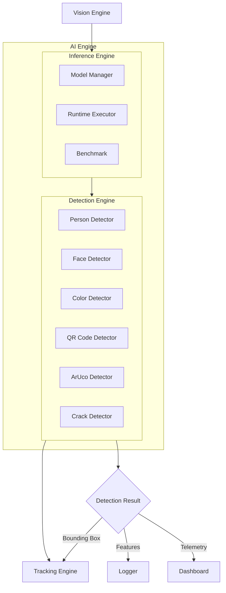
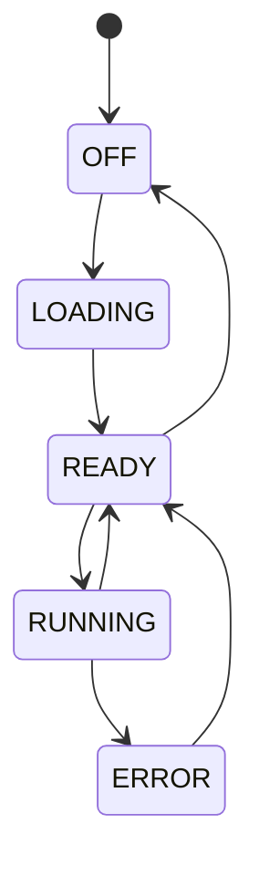
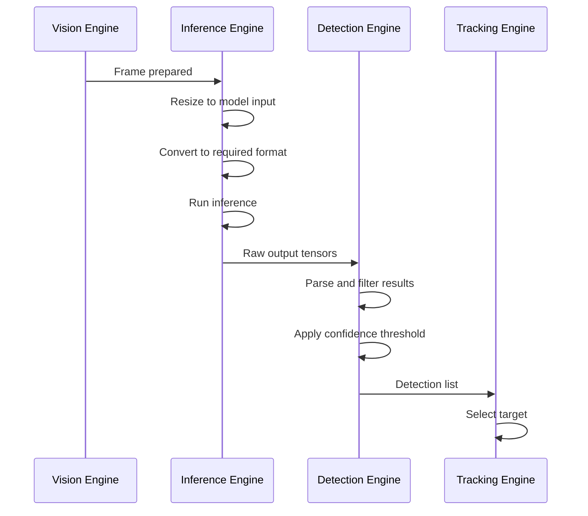

# SmartCam Platform — AI Engine

## Objective

Define the AI Engine (AIE) responsible for neural network inference and object detection. The architecture is split into two sub-engines: the Inference Engine (model execution) and the Detection Engine (result interpretation).

## Scope

This document covers the dual-engine AI architecture, model management, detector plugins, inference benchmarking, and integration with the Vision and Tracking Engines.

## Architecture



## Components

### Inference Engine



### Detection Plugins

Each detector implements the same interface:

```cpp
class Detector {
public:
    virtual bool loadModel();
    virtual DetectionResult detect(Frame& frame);
    virtual void unloadModel();
    virtual const char* getLabel();
};
```

| Plugin | Method | Framework | ETA |
|--------|--------|-----------|-----|
| Person | Neural network | ESP-DL | V1.0 |
| Face | Neural network | ESP-DL | V2.0 |
| Color | Vision Engine (HSV) | Classical | V1.1 |
| QR Code | Classical | quirc | V2.0 |
| ArUco | Classical | Custom | V2.0 |
| Neon Point | Vision Engine (HSV+Blob) | Classical | V3.0 |
| Crack | Vision Engine (Edge+Measure) | Classical | V3.0 |

## Fluxos

### Inference Pipeline



## Interfaces

### Detection Structure

```cpp
struct Detection {
    uint32_t id;
    String label;           // "person", "face", "neon", etc.
    float confidence;       // 0.0 to 1.0
    int x;                  // Bounding box left
    int y;                  // Bounding box top
    int width;              // Bounding box width
    int height;             // Bounding box height
    uint32_t timestamp;     // Capture timestamp
};
```

### AI Engine API

```cpp
class AIEngine {
public:
    Result begin();
    Result loadModel(const char* detectorName);
    Result runDetection(Frame& frame);
    Result setConfidenceThreshold(float threshold);
    Result setModelPath(const char* path);
    void getDetections(Vector<Detection>& output);
    AIStatus getStatus();
    BenchmarkData getBenchmark();
};
```

### Benchmark Data

```cpp
struct BenchmarkData {
    float inferenceTimeMs;    // Average inference time
    float fps;                // Inferences per second
    uint32_t ramUsage;        // Heap used
    uint32_t psramUsage;      // PSRAM used
    uint32_t totalInferences; // Lifetime count
};
```

## Estrutura de Pastas

```text
firmware/
    core/
        ai/
            ai_engine.h
            ai_engine.cpp
            inference.h
            inference.cpp
            detectors/
                person_detector.h
                person_detector.cpp
                face_detector.h
                face_detector.cpp
                color_detector.h
                color_detector.cpp
                aruco_detector.h
                aruco_detector.cpp
                qrcode_detector.h
                qrcode_detector.cpp
                crack_detector.h
                crack_detector.cpp
            models/
                model_manager.h
                model_manager.cpp
```

## Responsabilidades

| Component | Responsibility |
|-----------|----------------|
| AI Engine | Public API, detector registration, lifecycle |
| Inference Engine | Model loading, runtime execution, memory management |
| Detection Engine | Output parsing, confidence filtering, non-max suppression |
| Model Manager | Model storage, version management, cache |
| Detector Plugins | Domain-specific detection logic |

## Requisitos

| ID | Requirement |
|----|-------------|
| AI-001 | Person detection runs at minimum 5 FPS at QVGA |
| AI-002 | Model loading completes within 5 seconds |
| AI-003 | Inference memory is allocated from PSRAM, not DRAM |
| AI-004 | Detectors are hot-swappable without system restart |
| AI-005 | Confidence threshold is configurable from Dashboard |
| AI-006 | All detectors return the same Detection structure |
| AI-007 | Benchmark data is accessible via API and WebSocket |
| AI-008 | Model manager validates model compatibility before loading |
| AI-009 | Inference timeout triggers error recovery |
| AI-010 | Support ESP-DL (V1), TensorFlow Lite Micro (V2), Edge Impulse (V3) |

## Considerações

The AI Engine architecture separates model execution from result interpretation. The Inference Engine handles the runtime regardless of framework (ESP-DL, TensorFlow Lite, Edge Impulse), while the Detection Engine translates raw tensor outputs into structured `Detection` objects. This decoupling ensures that framework migrations do not affect downstream consumers (Tracking Engine, Dashboard). Classical computer vision detectors (color, blob, ArUco) also produce `Detection` objects, enabling uniform handling across all detection types.

## Próximos documentos relacionados

- [06-vision-engine.md](06-vision-engine.md) — Vision processing input
- [08-tracking-engine.md](08-tracking-engine.md) — Target selection and tracking
- [10-sdk-framework.md](10-sdk-framework.md) — Application plugin architecture
