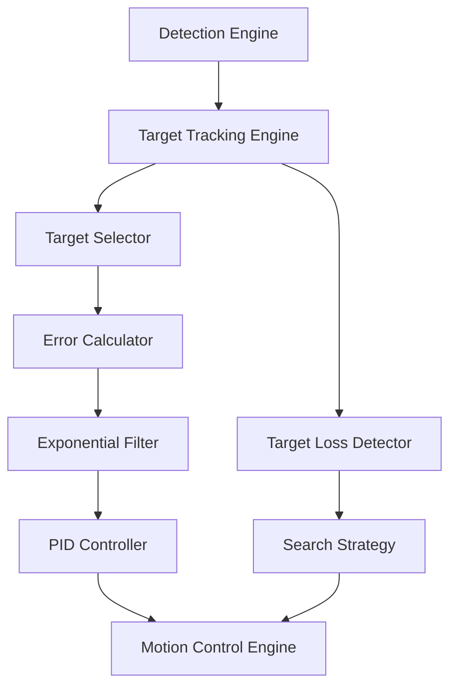
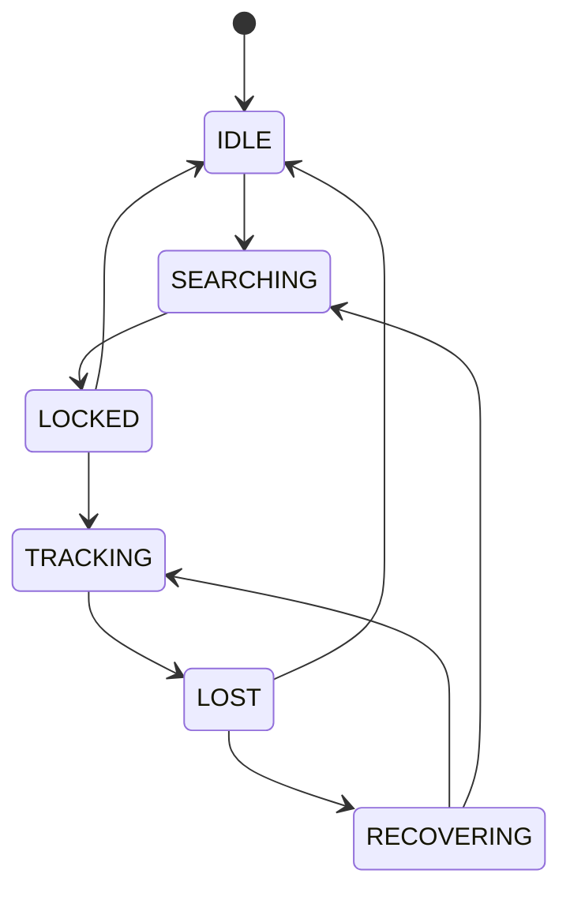
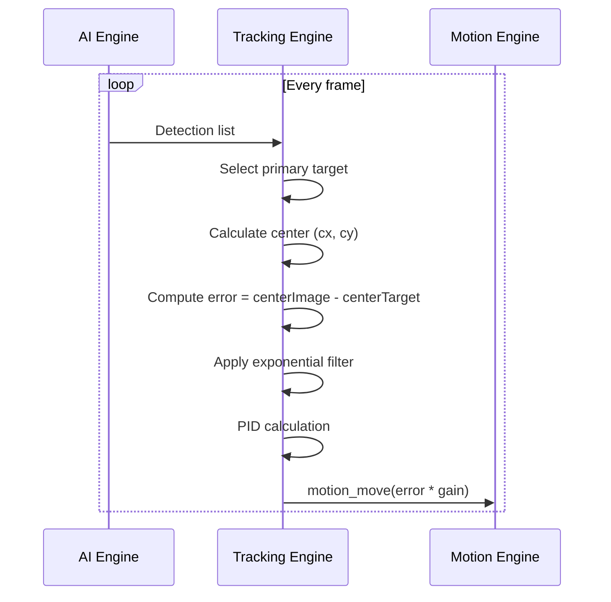

# SmartCam Platform — Target Tracking Engine

## Objective

Define the Target Tracking Engine (TTE) responsible for maintaining a target centered in the camera frame. The engine receives detections from the AI Engine and outputs motion commands to the Motion Control Engine.

## Scope

This document covers target selection, error calculation, PID control, dead zone management, target loss detection, search strategies, and the tracking state machine.

## Architecture



## Components

### Tracking State Machine



### Target Selection Criteria

| Mode | Criteria | Configurable |
|------|----------|-------------|
| Center | Closest to image center | Yes |
| Largest | Largest bounding box area | Yes |
| Confidence | Highest detection confidence | Yes |
| Manual | Explicit target ID | Yes |

## Fluxos

### Tracking Loop



### Target Loss and Recovery

```text
Target present for N consecutive frames
    |
    v
Target disappears
    |
    v
Start loss timer (configurable, default 1000 ms)
    |
    v
Timer expires without re-acquisition?
    |   YES
    v
Enter RECOVERING state
    |
    v
Strategy: continue last known direction
    |
    v
[Found] --> Return to TRACKING
    |
[Not found after sweep]
    |
    v
Strategy: oscillate (left/right sweep)
    |
    v
[Found] --> Return to TRACKING
    |
[Not found]
    |
    v
Return to center position
    |
    v
Enter IDLE state
```

### PID Algorithm

```text
error = setpoint - processVariable
    |
    v
P = Kp * error
    |
    v
I += Ki * error * dt (limited by anti-windup)
    |
    v
D = Kd * (error - previousError) / dt
    |
    v
output = P + I + D
    |
    v
Saturate output to [maxSpeed, -maxSpeed]
```

## Interfaces

### Target Structure

```cpp
struct Target {
    uint32_t id;
    String type;
    int x;              // Center X in pixels
    int y;              // Center Y in pixels
    int width;
    int height;
    float confidence;
    uint32_t timestamp;
};
```

### Tracking Engine API

```cpp
class TrackingEngine {
public:
    Result begin();
    Result start();
    Result stop();
    Result setTargetSelector(SelectorMode mode);
    Result setPID(float kp, float ki, float kd);
    Result setDeadZone(uint16_t pixels);
    Result setMaxSpeed(float rpm);
    Result manualLock(uint32_t targetId);
    TrackingStatus getStatus();
    Target getCurrentTarget();
};
```

### Configuration JSON

```json
{
    "enabled": true,
    "mode": "person",
    "selector": "center",
    "kp": 1.2,
    "ki": 0.0,
    "kd": 0.4,
    "dead_zone": 25,
    "max_speed": 200,
    "loss_timeout": 1000,
    "filter_alpha": 0.6
}
```

## Estrutura de Pastas

```text
firmware/
    core/
        tracking/
            tracking_engine.h
            tracking_engine.cpp
            tracking_selector.h
            tracking_selector.cpp
            tracking_pid.h
            tracking_pid.cpp
            tracking_filter.h
            tracking_filter.cpp
            tracking_search.h
            tracking_search.cpp
            tracking_config.h
            tracking_config.cpp
```

## Responsabilidades

| Component | Responsibility |
|-----------|----------------|
| Tracking Engine | Public API, state machine, flow orchestration |
| Target Selector | Multi-target prioritization and selection |
| PID Controller | Proportional, integral, derivative control |
| Exponential Filter | Noise reduction on target position |
| Search Strategy | Target re-acquisition algorithms |
| Configuration | Dead zone, loss timeout, filter parameters |

## Requisitos

| ID | Requirement |
|----|-------------|
| TRK-001 | Maintain target center within ±10 pixels of image center |
| TRK-002 | Dead zone prevents jitter when target is centered |
| TRK-003 | Target loss detection within configurable timeout |
| TRK-004 | PID anti-windup prevents integral saturation |
| TRK-005 | Support at least 4 concurrent detections for selection |
| TRK-006 | Manual target lock by ID overrides automatic selection |
| TRK-007 | Search strategies: direction-hold, oscillation, center-return |
| TRK-008 | Exponential filter alpha configurable from 0.1 to 0.9 |
| TRK-009 | Tracking state published via WebSocket every frame |
| TRK-010 | Tracking operates independently of detection type |

## Considerações

The Target Tracking Engine is agnostic to the type of target being tracked. Whether the target is a person (AI detection), a colored object (HSV blob), a neon marker (GeoFissura), or an ArUco code, the tracking logic remains identical. This is achieved by accepting a unified `Detection` structure from all detector types. The PID controller output maps directly to motion commands, enabling smooth and responsive tracking regardless of detection rate.

## Próximos documentos relacionados

- [05-motion-engine.md](05-motion-engine.md) — Motion control and axis movement
- [07-ai-engine.md](07-ai-engine.md) — Detection pipeline
- [09-behavior-engine.md](09-behavior-engine.md) — Application behavior orchestration
