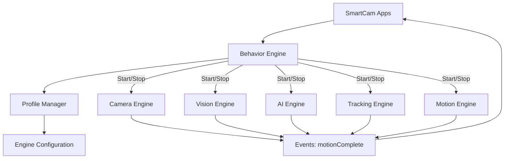
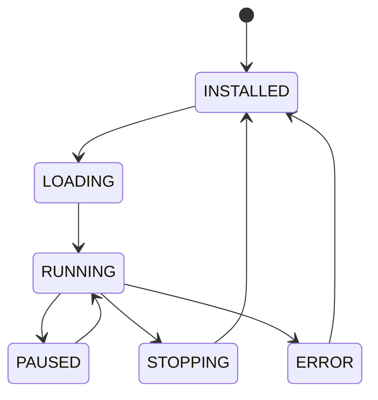
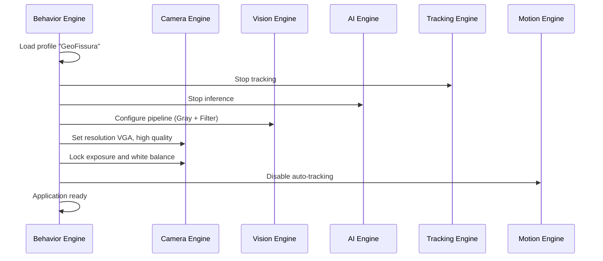

# SmartCam Platform — Behavior Engine

## Objective

Define the Behavior Engine (BE) responsible for orchestrating application-level logic by coordinating the Camera, Vision, AI, Tracking, and Motion Engines according to the active application profile.

## Scope

This document covers the application lifecycle, behavior definitions, profile-based engine configuration, and event-driven orchestration patterns.

## Architecture



## Components

### Application Lifecycle



### Behavior Definitions

| Application | Engines Used | Vision Pipeline | Detection | Motion |
|-------------|-------------|----------------|-----------|--------|
| Person Tracker | Camera, AI, Tracking, Motion | Resize + RGB888 | Person AI | PAN |
| Color Tracker | Camera, Vision, Tracking, Motion | HSV + Blob | Color | PAN |
| GeoFissura | Camera, Vision, Storage | Gray + Filter + Edge | Neon + Crack | Manual |
| Scanner | Camera, Motion | Full resolution | None | Step/Shoot |
| Time Lapse | Camera, Storage | JPEG capture | None | None |
| Face Tracker | Camera, AI, Tracking, Motion | Resize + RGB888 | Face AI | PAN |

## Fluxos

### Application Switching



### Person Tracker Behavior

```text
Application: PersonTracker
    |
    v
Initialize: Camera(QVGA), AI(person model), Tracking, Motion
    |
    v
Loop:
    Capture frame
    Run inference (person detection)
    Select primary target
    Calculate PID output
    Move axis
    Update Dashboard telemetry
    |
    v
On Stop: Release all engines
```

## Interfaces

### SmartCamApp Interface

```cpp
class SmartCamApp {
public:
    virtual bool onInit() = 0;
    virtual bool onStart() = 0;
    virtual void onFrame(Frame& frame) = 0;
    virtual void onDetection(Detection& obj) = 0;
    virtual void onTarget(Target& target) = 0;
    virtual void onStop() = 0;
    virtual const char* getName() = 0;
};
```

### Profile Definition

```json
{
    "profile": "person_tracker",
    "version": "1.0",
    "label": "Person Tracker",
    "engines": {
        "camera": { "resolution": "QVGA", "quality": 12, "fps": 20 },
        "vision": { "pipeline": "resize_rgb" },
        "ai": { "model": "person" },
        "tracking": { "enabled": true, "kp": 1.2, "ki": 0.0, "kd": 0.4 },
        "motion": { "axis": "pan", "max_speed": 200 }
    }
}
```

## Estrutura de Pastas

```text
firmware/
    core/
        behavior/
            behavior_engine.h
            behavior_engine.cpp
            behavior_profile.h
            behavior_profile.cpp
            behavior_registry.h
            behavior_registry.cpp
```

## Responsabilidades

| Component | Responsibility |
|-----------|----------------|
| Behavior Engine | Application lifecycle, engine orchestration |
| Profile Manager | Profile loading, validation, application |
| Behavior Registry | Application registration and discovery |

## Requisitos

| ID | Requirement |
|----|-------------|
| BEH-001 | Application switching completes within 2 seconds |
| BEH-002 | Profile defines engine configuration for each application |
| BEH-003 | Applications are pluggable via the SmartCamApp interface |
| BEH-004 | Engine resources are released when application stops |
| BEH-005 | Behavior Engine does not contain application-specific logic |
| BEH-006 | Profile switching is available from Dashboard |
| BEH-007 | Custom profiles can be created without firmware modification |
| BEH-008 | State transitions are published via WebSocket |

## Considerações

The Behavior Engine is the highest-level orchestrator in the SmartCam Platform. It treats each application as a self-contained unit that declares its engine requirements through a profile. This design ensures that adding a new application (e.g., GeoFissura) does not require modifying the Behavior Engine itself — only registering a new profile and implementing the SmartCamApp interface.

## Próximos documentos relacionados

- [10-sdk-framework.md](10-sdk-framework.md) — SmartCam SDK and app development
- [13-configuration-manager.md](13-configuration-manager.md) — Profile storage and management
- [20-roadmap.md](20-roadmap.md) — Application release timeline
