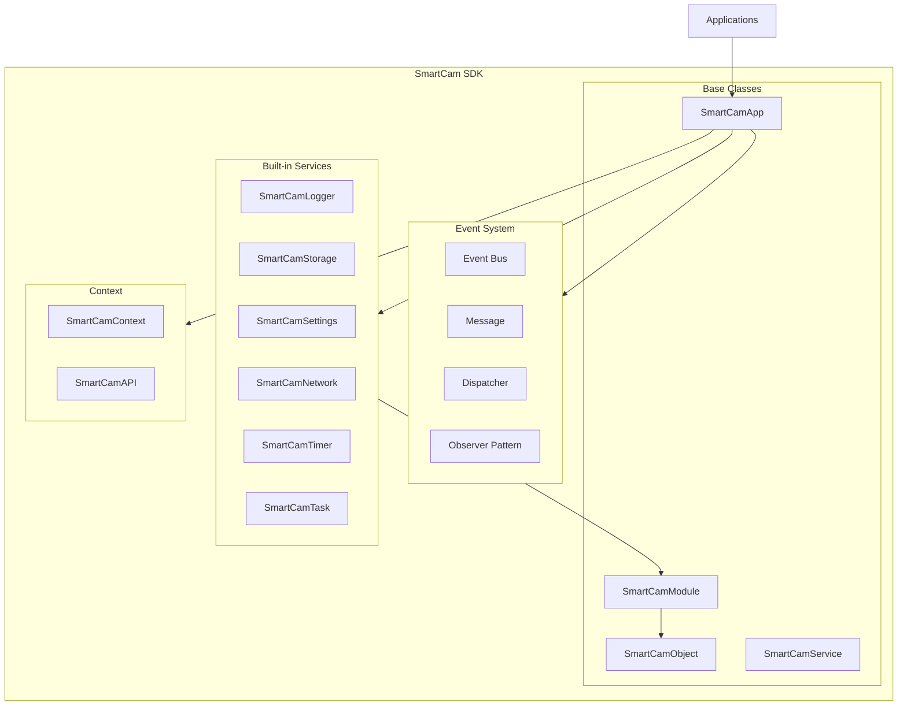
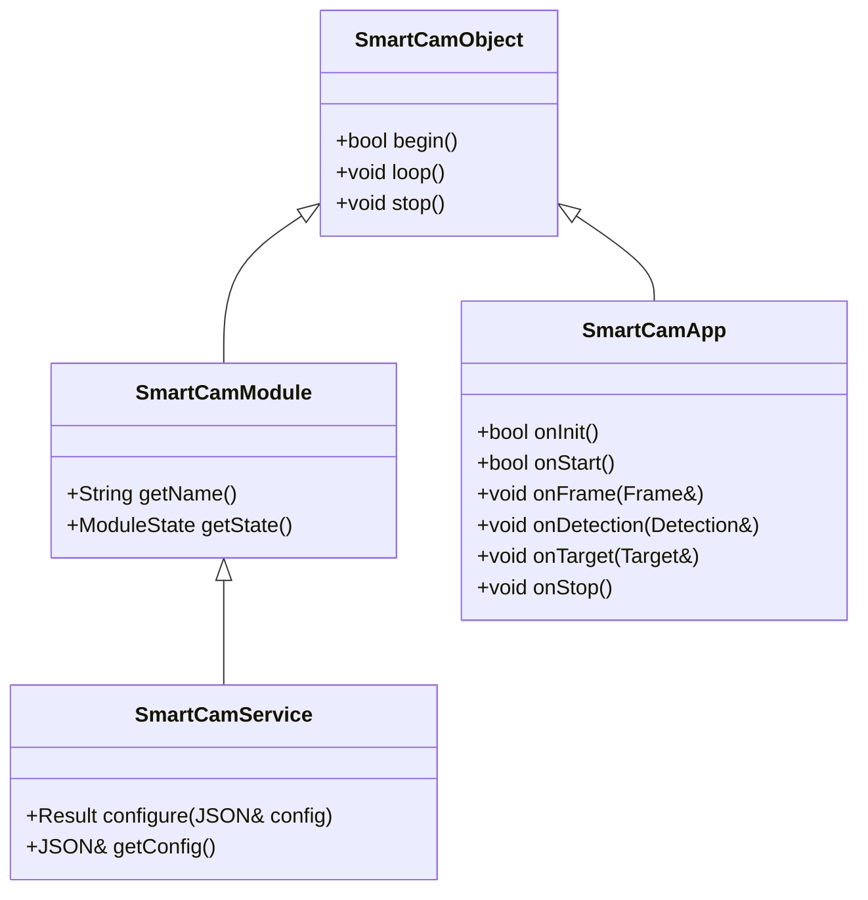
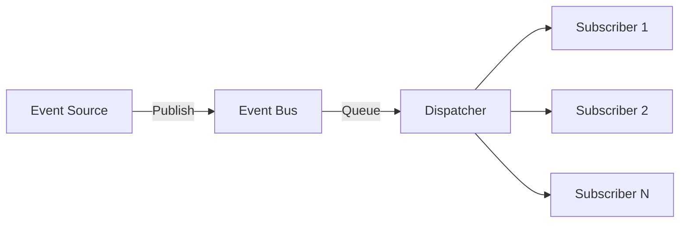
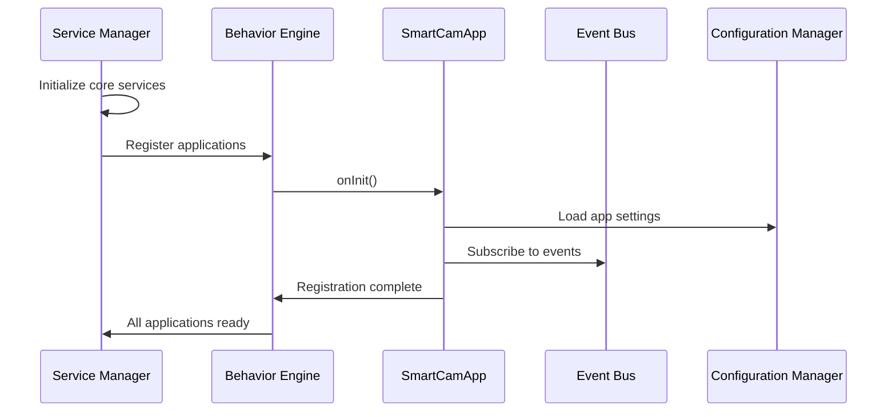

# SmartCam Platform — SmartCam SDK

## Objective

Define the SmartCam Software Development Kit (SDK), the framework layer that enables application development without hardware knowledge. The SDK provides base classes, the Event Bus, configuration abstraction, and standardized interfaces.

## Scope

This document covers the SDK architecture, class hierarchy, event system, dependency injection pattern, module management, and application development conventions.

## Architecture



## Components

### Class Hierarchy



### Event Bus Architecture



### Event Types

```cpp
enum class EventType {
    SYSTEM_BOOT,
    CAMERA_READY,
    CAMERA_ERROR,
    FRAME_READY,
    DETECTION_READY,
    TARGET_LOCKED,
    TARGET_LOST,
    TARGET_RECOVERED,
    TRACKING_STARTED,
    TRACKING_STOPPED,
    MOTION_STARTED,
    MOTION_FINISHED,
    MOTION_STOPPED,
    WIFI_CONNECTED,
    WIFI_DISCONNECTED,
    OTA_STARTED,
    OTA_FINISHED,
    OTA_ERROR,
    ERROR_OCCURRED,
    PROFILE_CHANGED,
    CONFIG_UPDATED
};
```

## Fluxos

### Application Registration



## Interfaces

### SmartCamObject (Base)

```cpp
class SmartCamObject {
public:
    virtual bool begin();
    virtual void loop();
    virtual void stop();
    bool isRunning();
    String getName();
};
```

### SmartCamApp (Application)

```cpp
class SmartCamApp {
public:
    virtual bool onInit();
    virtual bool onStart();
    virtual void onFrame(Frame& frame);
    virtual void onDetection(Detection& detection);
    virtual void onTarget(Target& target);
    virtual void onStop();
    virtual const char* getName() = 0;

protected:
    SmartCamContext* context;
    SmartCamAPI* api;
};
```

### Event Bus API

```cpp
class EventBus {
public:
    bool subscribe(EventType event, SmartCamObject* subscriber);
    bool unsubscribe(EventType event, SmartCamObject* subscriber);
    bool publish(Message& message);
    void dispatch();  // Process queued events
};
```

### SmartCamAPI

```cpp
class SmartCamAPI {
public:
    // Camera
    Result cameraCapture(Frame& frame);
    Result cameraSetConfig(const JSON& config);

    // Motion
    Result motionMove(float degrees);
    Result motionStop();
    Result motionHome();

    // Tracking
    Result trackingStart();
    Result trackingStop();
    Result trackingSetPID(float kp, float ki, float kd);

    // Vision
    Result visionApplyFilter(FilterType type);

    // Storage
    Result storageSave(const String& path, const uint8_t* data, size_t len);
    Result storageLoad(const String& path, uint8_t* data, size_t len);

    // Logger
    void logInfo(const String& module, const String& message);
    void logError(const String& module, const String& message);
    void logDebug(const String& module, const String& message);

    // Settings
    String settingsGet(const String& key);
    bool settingsSet(const String& key, const String& value);
};
```

## Estrutura de Pastas

```text
sdk/
    core/
        SmartCamObject.h
        SmartCamObject.cpp
        SmartCamModule.h
        SmartCamModule.cpp
        SmartCamService.h
        SmartCamService.cpp
    interfaces/
        SmartCamApp.h
        SmartCamApp.cpp
    events/
        EventBus.h
        EventBus.cpp
        SmartCamMessage.h
    services/
        SmartCamLogger.h
        SmartCamLogger.cpp
        SmartCamStorage.h
        SmartCamStorage.cpp
        SmartCamSettings.h
        SmartCamSettings.cpp
        SmartCamNetwork.h
        SmartCamNetwork.cpp
        SmartCamTimer.h
        SmartCamTimer.cpp
        SmartCamTask.h
        SmartCamTask.cpp
    modules/
        ModuleManager.h
        ModuleManager.cpp
        ServiceManager.h
        ServiceManager.cpp
    context/
        SmartCamContext.h
        SmartCamContext.cpp
        SmartCamAPI.h
        SmartCamAPI.cpp
```

## Responsabilidades

| Component | Responsibility |
|-----------|----------------|
| SmartCamObject | Base lifecycle (begin, loop, stop) |
| SmartCamModule | Module identification and state reporting |
| SmartCamService | Configurable service with JSON schema |
| SmartCamApp | Application interface for domain logic |
| EventBus | Decoupled publish/subscribe messaging |
| SmartCamAPI | Unified access to all platform services |
| ModuleManager | Module registration and lifecycle |
| ServiceManager | Service initialization and dependency resolution |

## Requisitos

| ID | Requirement |
|----|-------------|
| SDK-001 | All applications implement SmartCamApp interface |
| SDK-002 | No application accesses GPIO, Wi-Fi, or hardware directly |
| SDK-003 | Event Bus supports at least 32 subscribers per event |
| SDK-004 | Module Manager tracks all registered modules |
| SDK-005 | SmartCamAPI provides complete hardware abstraction |
| SDK-006 | Logger supports 6 levels: trace, debug, info, warning, error, fatal |
| SDK-007 | Timer abstraction replaces raw millis()/micros() calls |
| SDK-008 | Task abstraction wraps FreeRTOS xTaskCreate |
| SDK-009 | Settings abstraction manages NVS and JSON persistence |
| SDK-010 | Applications can be added without modifying core code |

## Considerações

The SmartCam SDK is the key architectural decision that transforms the project from a single-purpose firmware into a platform. By requiring all applications to implement the SmartCamApp interface, the SDK ensures that domain logic is never coupled to hardware details. The Event Bus enables loose coupling between all system components, allowing modules to be added, removed, or replaced without affecting the rest of the system.

## Próximos documentos relacionados

- [02-system-architecture.md](02-system-architecture.md) — System architecture and layering
- [09-behavior-engine.md](09-behavior-engine.md) — Application orchestration
- [17-coding-standard.md](17-coding-standard.md) — C++ coding conventions for SDK development
