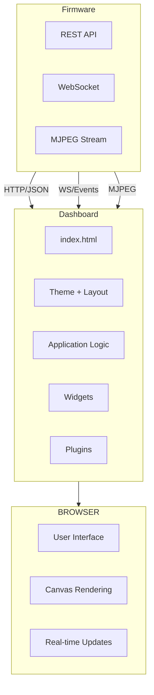
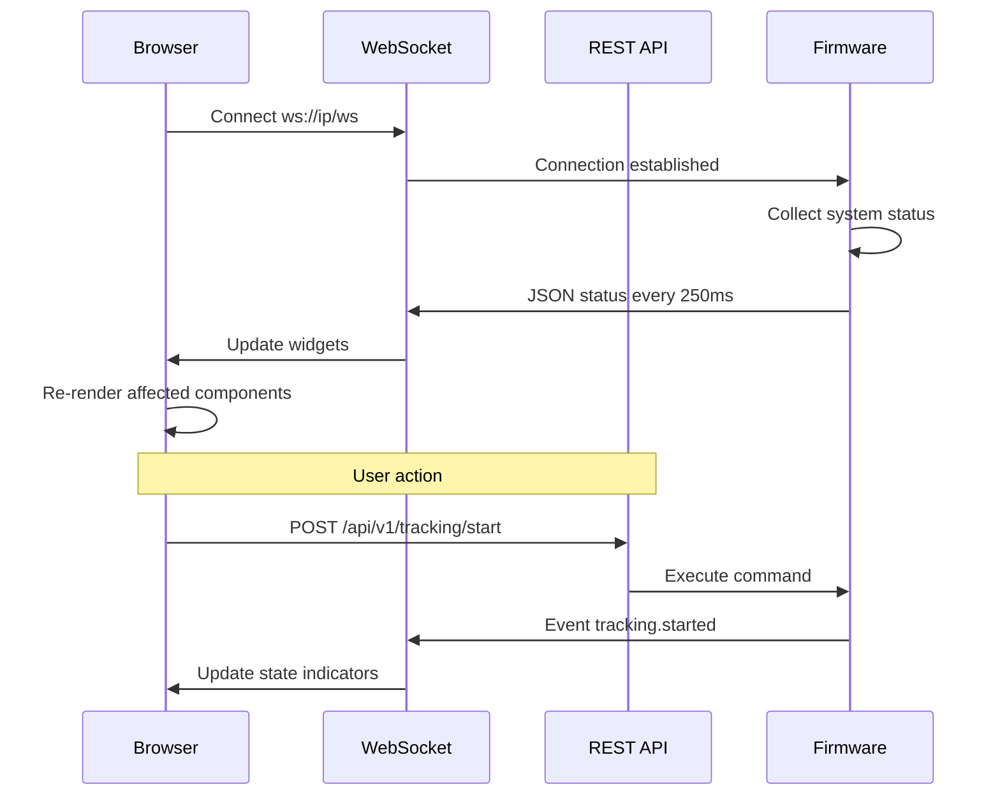

# SmartCam Platform — SmartCam Dashboard

## Objective

Define the SmartCam Dashboard, the embedded web-based user interface for monitoring, configuration, and operation of the SmartCam Platform. The Dashboard operates entirely within a browser and communicates with the firmware via REST API and WebSocket.

## Scope

This document covers the Dashboard architecture, page structure, widget system, real-time updates, theming, responsive design, and plugin support for application-specific pages.

## Architecture



## Components

### Page Structure

```text
Main Layout
    |
    +-- Top Bar (status bar: Wi-Fi, IP, FPS, CPU, RAM, time)
    |
    +-- Side Menu (navigation)
    |   +-- Dashboard
    |   +-- Camera
    |   +-- Motion
    |   +-- Tracking
    |   +-- Vision
    |   +-- AI
    |   +-- Profiles
    |   +-- Storage
    |   +-- Logs
    |   +-- OTA
    |   +-- Settings
    |   +-- About
    |
    +-- Content Area (dynamic page routing)
    |
    +-- Bottom Bar (system state)
```

### Dashboard Page

```text
+----------------------------------------------+
| Status Bar                                    |
+----------------------------------------------+
|    |  +----------------------------------+   |
|    |  |  Live Video Stream               |   |
| M  |  |                                  |   |
| e  |  +----------------------------------+   |
| n  |  | CPU | RAM | FPS | Temp | Wi-Fi  |   |
| u  |  +----------------------------------+   |
|    |  | Tracking: IDLE | Motor: STOPPED  |   |
|    |  +----------------------------------+   |
+----------------------------------------------+
```

### Widgets

All Dashboard elements are widgets:

| Widget | Reusable | Pages Used |
|--------|----------|------------|
| Video Stream | Yes | Dashboard, Camera |
| FPS Gauge | Yes | Dashboard, Camera, Vision |
| CPU/RAM Graph | Yes | Dashboard |
| Motor Control | Yes | Dashboard, Motion |
| Tracking Status | Yes | Dashboard, Tracking |
| PID Tuner | No | Tracking only |
| Filter Preview | No | Vision only |

## Fluxos

### Real-Time Update Flow



### Page Routing

```javascript
// Client-side routing without page reload
const routes = {
    '/': 'pages/dashboard.html',
    '/camera': 'pages/camera.html',
    '/motion': 'pages/motion.html',
    '/tracking': 'pages/tracking.html',
    '/vision': 'pages/vision.html',
    '/ai': 'pages/ai.html',
    '/profiles': 'pages/profiles.html',
    '/storage': 'pages/storage.html',
    '/logs': 'pages/logs.html',
    '/ota': 'pages/ota.html',
    '/settings': 'pages/settings.html',
    '/about': 'pages/about.html'
};
```

## Interfaces

### WebSocket Event Format

```json
// System status update (250ms interval)
{
    "event": "status.update",
    "data": {
        "fps": 22,
        "cpu": 15,
        "heap": 245000,
        "psram": 7300000,
        "temperature": 41.2,
        "wifi_rssi": -45,
        "state": "TRACKING",
        "motor_position": 4500
    }
}

// Event notification
{
    "event": "target.locked",
    "data": {
        "target_id": 7,
        "confidence": 0.94,
        "x": 160,
        "y": 120
    }
}
```

### Plugin Interface

Each application plugin extends the Dashboard with its own page:

```text
web/plugins/
    person_tracker/
        manifest.json
        index.html
        index.js
        index.css
    geofissura/
        manifest.json
        index.html
        index.js
        index.css
```

## Estrutura de Pastas

```text
web/
    index.html
    css/
        main.css
        theme.css
        layout.css
        components.css
    js/
        app.js              Application shell
        api.js              REST client
        websocket.js        WebSocket client
        router.js           SPA router
        pages/
            dashboard.js
            camera.js
            motion.js
            tracking.js
            vision.js
            ai.js
            profiles.js
            storage.js
            logs.js
            ota.js
            settings.js
            about.js
    widgets/
        fps.js
        cpu.js
        stream.js
        motor.js
        tracking.js
    plugins/
        person_tracker/
        geofissura/
    img/
    icons/
    fonts/
```

## Responsabilidades

| Component | Responsibility |
|-----------|----------------|
| index.html | Application shell, layout containers |
| CSS | Theming (dark/light), layout, responsive breakpoints |
| app.js | Application bootstrap, menu, navigation |
| api.js | REST API client with fetch |
| websocket.js | WebSocket connection management and reconnection |
| router.js | Client-side routing with hash-based navigation |
| Pages | Individual page logic and rendering |
| Widgets | Reusable UI components |
| Plugins | Application-specific pages |

## Requisitos

| ID | Requirement |
|----|-------------|
| DSH-001 | Dashboard loads entirely from LittleFS, no external CDN |
| DSH-002 | Real-time updates via WebSocket with automatic reconnection |
| DSH-003 | Responsive layout supporting desktop, tablet, and mobile |
| DSH-004 | Dark and light theme with instant toggle |
| DSH-005 | MJPEG video stream on Dashboard and Camera pages |
| DSH-006 | All configuration changes persist without page reload |
| DSH-007 | Plugin system for application-specific pages |
| DSH-008 | Canvas-based real-time FPS, CPU, and RAM graphs |
| DSH-009 | Notification system for events and errors |
| DSH-010 | Works without JavaScript frameworks (vanilla HTML/CSS/JS) |

## Considerações

The Dashboard is designed as a single-page application (SPA) that runs entirely from the ESP32's LittleFS. No external dependencies, CDN resources, or JavaScript frameworks are required. The vanilla HTML/CSS/JS approach keeps the total compressed size under 256 KB, ensuring fast loading even over Wi-Fi. The WebSocket connection provides sub-250ms status updates, while the REST API handles all configuration mutations.

## Próximos documentos relacionados

- [12-api-rest-websocket.md](12-api-rest-websocket.md) — REST endpoints and WebSocket protocol
- [15-network-ota.md](15-network-ota.md) — Wi-Fi configuration and OTA
- [13-configuration-manager.md](13-configuration-manager.md) — Profile management
