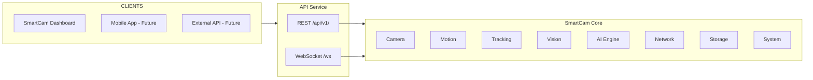
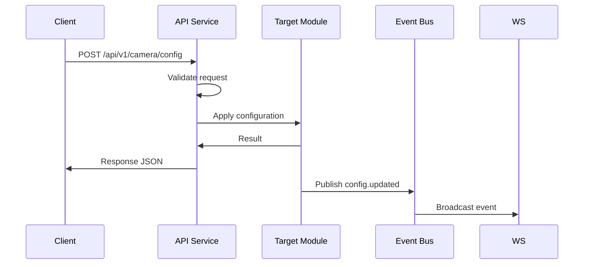

# SmartCam Platform — API REST + WebSocket

## Objective

Define the complete API specification for communication between the SmartCam Dashboard, firmware, and future external clients. All communication uses REST over HTTP for command/response and WebSocket for real-time events.

## Scope

This document covers all REST endpoints, JSON response formats, WebSocket event protocol, HTTP status codes, error codes, and API versioning strategy.

## Architecture



## Components

### API Versioning

All endpoints are prefixed with `/api/v1/`. Future versions will use `/api/v2/` while maintaining backward compatibility for v1.

### Response Format

All responses follow a unified structure:

```json
// Success
{
    "success": true,
    "code": 0,
    "message": "OK",
    "data": {}
}

// Error
{
    "success": false,
    "code": "CAM001",
    "message": "Camera not initialized",
    "data": null
}
```

## Fluxos

### Request/Response Flow



## Interfaces

### REST Endpoints

#### System

| Method | Endpoint | Description |
|--------|----------|-------------|
| GET | `/api/v1/system/status` | System health (CPU, RAM, uptime, temperature) |
| GET | `/api/v1/system/info` | Firmware version, hardware info |
| POST | `/api/v1/system/reboot` | Restart the system |

#### Camera

| Method | Endpoint | Description |
|--------|----------|-------------|
| GET | `/api/v1/camera/status` | Camera state, FPS, resolution |
| GET | `/api/v1/camera/config` | Current camera settings |
| POST | `/api/v1/camera/config` | Update camera settings |
| POST | `/api/v1/camera/snapshot` | Capture a photo |
| POST | `/api/v1/camera/restart` | Reinitialize camera sensor |

#### Motion

| Method | Endpoint | Description |
|--------|----------|-------------|
| GET | `/api/v1/motion/status` | Axis positions, state, speed |
| GET | `/api/v1/motion/config` | Axis configuration |
| POST | `/api/v1/motion/move` | Execute movement |
| POST | `/api/v1/motion/stop` | Emergency stop |
| POST | `/api/v1/motion/home` | Execute homing sequence |
| POST | `/api/v1/motion/config` | Update axis configuration |

#### Tracking

| Method | Endpoint | Description |
|--------|----------|-------------|
| GET | `/api/v1/tracking/status` | Tracking state, target info |
| POST | `/api/v1/tracking/start` | Start tracking |
| POST | `/api/v1/tracking/stop` | Stop tracking |
| POST | `/api/v1/tracking/config` | Update PID and dead zone |

#### Vision

| Method | Endpoint | Description |
|--------|----------|-------------|
| GET | `/api/v1/vision/status` | Vision pipeline state |
| POST | `/api/v1/vision/filter` | Apply filter to frame |
| POST | `/api/v1/vision/blob` | Run blob detection |

#### AI

| Method | Endpoint | Description |
|--------|----------|-------------|
| GET | `/api/v1/ai/model` | Current model info |
| POST | `/api/v1/ai/model` | Switch detection model |
| POST | `/api/v1/ai/start` | Start inference |
| POST | `/api/v1/ai/stop` | Stop inference |

#### Network

| Method | Endpoint | Description |
|--------|----------|-------------|
| GET | `/api/v1/network/status` | Wi-Fi connection status |
| GET | `/api/v1/network/scan` | List available networks |
| POST | `/api/v1/network/connect` | Connect to Wi-Fi network |

#### Storage

| Method | Endpoint | Description |
|--------|----------|-------------|
| GET | `/api/v1/storage/files` | List stored files |
| GET | `/api/v1/storage/file` | Download a file |
| POST | `/api/v1/storage/delete` | Delete a file |

#### Profiles

| Method | Endpoint | Description |
|--------|----------|-------------|
| GET | `/api/v1/profiles` | List available profiles |
| POST | `/api/v1/profiles/load` | Load a profile |
| POST | `/api/v1/profiles/save` | Save current config as profile |

#### Logger

| Method | Endpoint | Description |
|--------|----------|-------------|
| GET | `/api/v1/logger` | Recent log entries |
| POST | `/api/v1/logger/clear` | Clear log buffer |
| GET | `/api/v1/logger/download` | Download log file |

#### Diagnostics

| Method | Endpoint | Description |
|--------|----------|-------------|
| GET | `/api/v1/diagnostics` | Full system diagnostic status |

#### Dashboard

| Method | Endpoint | Description |
|--------|----------|-------------|
| GET | `/api/v1/dashboard` | Aggregated status for Dashboard home |

### WebSocket Protocol

Endpoint: `ws://device-ip/ws`

#### Server Events

```json
// System status (250ms interval)
{
    "event": "status.update",
    "fps": 22,
    "cpu": 15,
    "heap": 245000,
    "psram": 7300000,
    "temperature": 41.2
}

// State change notification
{
    "event": "tracking.started"
}

// Target events
{
    "event": "target.locked",
    "data": { "id": 4, "confidence": 0.94 }
}

{
    "event": "target.lost",
    "data": { "id": 4 }
}

// Motion events
{
    "event": "motion.finished",
    "data": { "axis": "pan", "position": 4500 }
}

// Error events
{
    "event": "error",
    "data": { "code": "CAM002", "message": "Frame timeout" }
}
```

### Error Codes

| Code | Description |
|------|-------------|
| CAM001 | Camera initialization failure |
| CAM002 | Frame capture timeout |
| MOT001 | Driver not enabled |
| MOT002 | Soft limit reached |
| MOT003 | Axis not initialized |
| TRK001 | No target selected |
| AI001 | Model not loaded |
| AI002 | Inference timeout |
| NET001 | Wi-Fi disconnected |
| STO001 | Storage full |
| SYS001 | System error |

## Estrutura de Pastas

```text
firmware/
    api/
        api_service.h
        api_service.cpp
        api_routes.h
        api_routes.cpp
        api_websocket.h
        api_websocket.cpp
        api_auth.h
        api_auth.cpp
        api_middleware.h
        api_middleware.cpp
```

## Responsabilidades

| Component | Responsibility |
|-----------|----------------|
| API Service | Route registration, request dispatch |
| API Routes | Endpoint handler implementations |
| API WebSocket | Connection management, event broadcast |
| API Auth | Authentication (V2.0+) |
| API Middleware | Request validation, logging, error formatting |

## Requisitos

| ID | Requirement |
|----|-------------|
| API-001 | All responses follow unified JSON format |
| API-002 | WebSocket events are broadcast to all connected clients |
| API-003 | Status updates at 250ms intervals via WebSocket |
| API-004 | REST endpoints support concurrent requests |
| API-005 | Error codes are unique and documented |
| API-006 | API version prefix enables backward compatibility |
| API-007 | WebSocket auto-reconnect with exponential backoff |
| API-008 | CORS headers for cross-origin Dashboard access |
| API-009 | Authentication is optional (V1) and required (V2) |
| API-010 | Diagnostics endpoint tests all subsystems |

## Considerações

API versioning through URL prefix (`/api/v1/`) ensures that Dashboard and external clients continue working across firmware upgrades. The WebSocket protocol uses a simple event-based JSON format, making it easy to integrate with Home Assistant, Node-RED, and custom automation systems. The unified response format simplifies client-side error handling across all endpoints.

## Próximos documentos relacionados

- [11-dashboard-web.md](11-dashboard-web.md) — Dashboard front-end implementation
- [13-configuration-manager.md](13-configuration-manager.md) — Profile and settings API
- [15-network-ota.md](15-network-ota.md) — Network configuration and OTA
