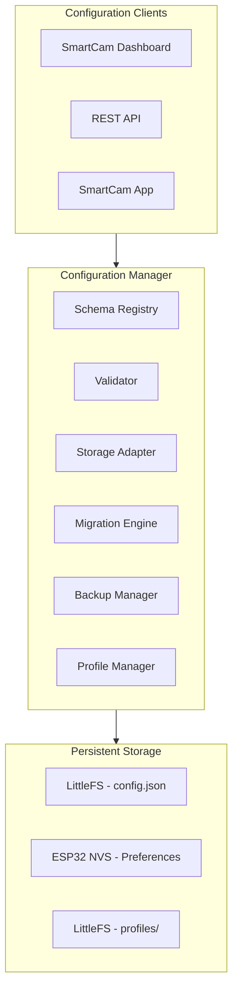
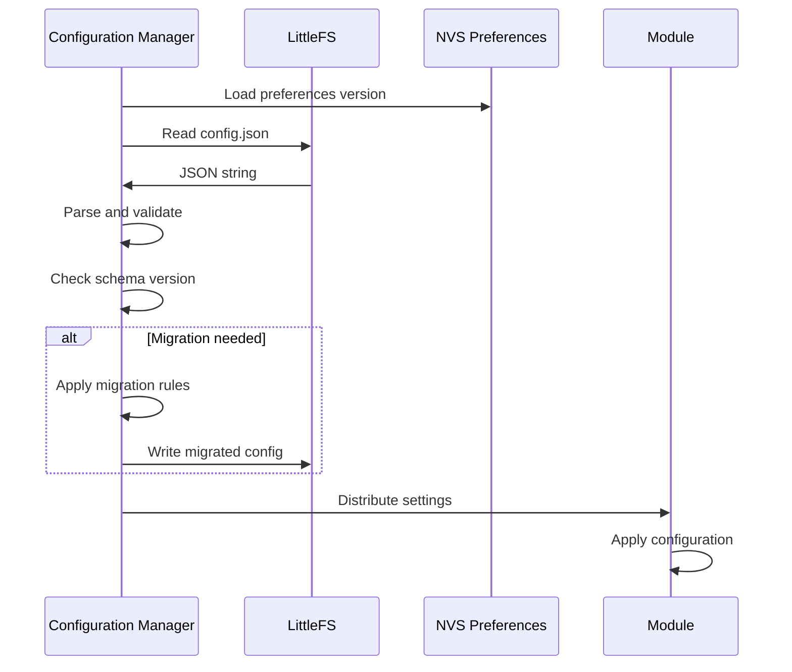

# SmartCam Platform — Configuration Manager

## Objective

Define the Configuration Manager, the centralized service responsible for all persistent settings across the SmartCam Platform. No module reads or writes to storage directly — all operations pass through this manager.

## Scope

This document covers configuration schema, persistence strategy, profile management, backup/restore, migration, import/export, and validation rules.

## Architecture



## Components

### Configuration Schema

```json
{
    "version": "1.0",
    "system": {
        "name": "SmartCam OS",
        "language": "en",
        "theme": "dark",
        "timezone": "UTC"
    },
    "wifi": {
        "mode": "STA",
        "ssid": "",
        "password": "",
        "hostname": "smartcam-os",
        "ip_mode": "dhcp"
    },
    "camera": {
        "resolution": "QVGA",
        "quality": 12,
        "brightness": 0,
        "contrast": 0,
        "saturation": 0,
        "mirror": false,
        "flip": false,
        "fps": 20,
        "aec": true,
        "agc": true,
        "awb": true
    },
    "motion": {
        "axis": "pan",
        "steps_per_rev": 200,
        "microstep": 16,
        "max_speed": 300,
        "max_acceleration": 500,
        "soft_limit_left": -180,
        "soft_limit_right": 180,
        "reverse_dir": false,
        "idle_timeout": 5000
    },
    "driver": {
        "model": "DM556D",
        "current": 2.8,
        "enabled": true
    },
    "tracking": {
        "enabled": false,
        "mode": "person",
        "selector": "center",
        "kp": 1.2,
        "ki": 0.0,
        "kd": 0.4,
        "dead_zone": 25,
        "max_speed": 200,
        "loss_timeout": 1000,
        "filter_alpha": 0.6
    },
    "dashboard": {
        "show_fps": true,
        "show_cpu": true,
        "show_memory": true,
        "show_temperature": true,
        "show_logs": true
    },
    "security": {
        "login": "admin",
        "password": ""
    },
    "hardware": {
        "board": "T-SIMCAM",
        "camera": "OV2640",
        "driver": "DM556D",
        "motor": "NEMA23",
        "power_voltage": 24,
        "mechanical": "direct"
    }
}
```

### Profile Structure

```text
profiles/
    person_tracker.json
    color_tracker.json
    geofissura.json
    scanner.json
    timelapse.json
    inspection.json
    custom_profile.json
```

Each profile contains a complete configuration snapshot for a specific application.

## Fluxos

### Configuration Load Flow



### Profile Switching

```text
User selects profile on Dashboard
    |
    v
POST /api/v1/profiles/load { "profile": "geofissura" }
    |
    v
Configuration Manager loads geofissura.json
    |
    v
Validate all parameters against schema
    |
    v
Apply to all modules
    |
    v
Behavior Engine switches application
    |
    v
Dashboard receives WebSocket event
```

## Interfaces

### Configuration Manager API

```cpp
class ConfigurationManager {
public:
    Result begin();
    Result load();
    Result save();

    // Per-module access
    JSON& getConfig(const String& module);
    Result setConfig(const String& module, const JSON& config);

    // Profiles
    Result loadProfile(const String& name);
    Result saveProfile(const String& name);
    Result listProfiles(Vector<String>& names);
    Result deleteProfile(const String& name);

    // Import/Export
    Result exportConfig(String& output);
    Result importConfig(const String& input);

    // Backup
    Result createBackup();
    Result restoreBackup();

    // Reset
    Result factoryReset();

    // Validation
    bool validate(const JSON& config, String& error);
};
```

### Module Configuration Registration

```cpp
class ConfigurableModule {
    virtual JSON getDefaultConfig() = 0;
    virtual bool validateConfig(const JSON& config) = 0;
    virtual Result applyConfig(const JSON& config) = 0;
};
```

## Estrutura de Pastas

```text
firmware/
    config/
        config_manager.h
        config_manager.cpp
        config_schema.h
        config_schema.cpp
        config_validator.h
        config_validator.cpp
        config_profile.h
        config_profile.cpp
        config_backup.h
        config_backup.cpp
        config_migration.h
        config_migration.cpp
        config_export.h
        config_export.cpp
```

## Responsabilidades

| Component | Responsibility |
|-----------|----------------|
| Configuration Manager | Public API, load/save orchestration |
| Schema Validator | Type checking, range validation, required fields |
| Profile Manager | Profile CRUD operations |
| Backup Manager | Automatic configuration backups |
| Migration Engine | Version-to-version config migration |
| Export/Import | JSON export and import with validation |

## Requisitos

| ID | Requirement |
|----|-------------|
| CFG-001 | All module settings are stored in a single JSON file |
| CFG-002 | Configuration is loaded once at boot and cached in RAM |
| CFG-003 | Partial updates apply only changed fields |
| CFG-004 | Profile switching changes all relevant module settings |
| CFG-005 | Automatic backup before every configuration save |
| CFG-006 | Migration engine converts config between versions |
| CFG-007 | Factory reset restores default configuration |
| CFG-008 | Import validates file version, structure, and values |
| CFG-009 | Each module registers its schema with the manager |
| CFG-010 | Backup is stored as config.bak in LittleFS |

## Considerações

The Configuration Manager is the single source of truth for all persistent settings. By centralizing configuration, the platform ensures consistency across modules, enables atomic profile switching, and simplifies backup/restore operations. The schema registry pattern allows modules to declare their configuration requirements independently, enabling automatic validation without hardcoded rules in the manager.

## Próximos documentos relacionados

- [09-behavior-engine.md](09-behavior-engine.md) — Profile-driven application behavior
- [14-storage-logger.md](14-storage-logger.md) — Storage and file management
- [12-api-rest-websocket.md](12-api-rest-websocket.md) — Configuration API endpoints
