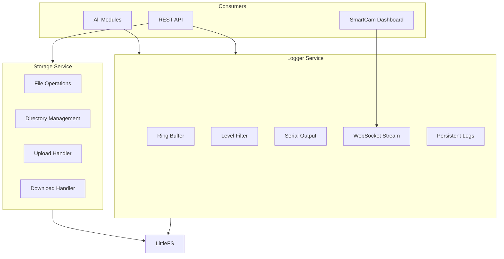
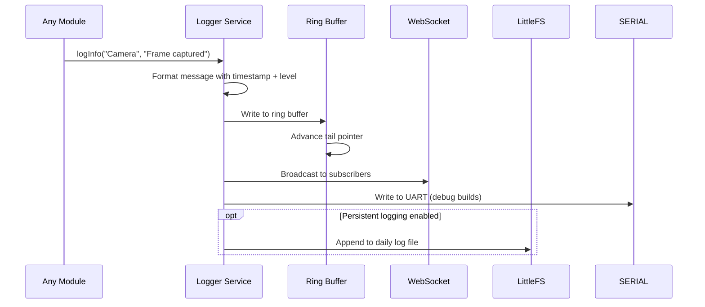

# SmartCam Platform — Storage and Logger

## Objective

Define the Storage Service and Logger Service, two infrastructure modules that provide persistent file management and structured event logging across the SmartCam Platform.

## Scope

This document covers the Storage Service (LittleFS file operations, directory management, file upload/download) and Logger Service (message buffering, level filtering, WebSocket streaming, log export).

## Architecture



## Components

### Storage Service

### File System Layout

```text
LittleFS Root
    |
    +-- index.html
    +-- css/
    +-- js/
    +-- config.json
    +-- config.bak
    +-- profiles/
    |   +-- person_tracker.json
    |   +-- geofissura.json
    +-- logs/
    |   +-- 2026-06-28.log
    +-- photos/
    |   +-- snap_001.jpg
    +-- models/
        +-- person.tflite
```

### Logger Service

### Log Levels

| Level | Value | Description |
|-------|-------|-------------|
| TRACE | 0 | Detailed debugging information |
| DEBUG | 1 | General debugging information |
| INFO | 2 | Normal operational messages |
| WARNING | 3 | Potential issues |
| ERROR | 4 | Operation failures |
| FATAL | 5 | Critical system errors |

### Ring Buffer

```text
Log entries are stored in a pre-allocated ring buffer:
    [entry_0][entry_1]...[entry_N-1]
          ^               ^
        head            tail
```

## Fluxos

### Log Write Flow



### File Upload Flow

```text
Dashboard sends file via multipart/form-data
    |
    v
POST /api/v1/storage/upload
    |
    v
Validate file extension and size
    |
    v
Stream to LittleFS in chunks
    |
    v
Verify hash after transfer
    |
    v
Return success with file info
```

## Interfaces

### Storage Service API

```cpp
class StorageService {
public:
    Result begin();
    bool fileExists(const String& path);
    Result fileRead(const String& path, uint8_t* buffer, size_t& size);
    Result fileWrite(const String& path, const uint8_t* data, size_t size);
    Result fileDelete(const String& path);
    Result fileRename(const String& oldPath, const String& newPath);
    Result fileList(const String& dir, Vector<FileInfo>& files);
    Result dirCreate(const String& path);
    uint64_t totalSpace();
    uint64_t usedSpace();
    uint64_t freeSpace();
};
```

### Logger Service API

```cpp
class LoggerService {
public:
    Result begin();
    void trace(const String& module, const String& message);
    void debug(const String& module, const String& message);
    void info(const String& module, const String& message);
    void warning(const String& module, const String& message);
    void error(const String& module, const String& message);
    void fatal(const String& module, const String& message);
    void setLevel(LogLevel minLevel);
    void getLogs(Vector<LogEntry>& output, uint16_t count);
    void clear();
    Result exportToFile(const String& path);
    void subscribe(std::function<void(LogEntry&)> callback);
};
```

### Log Entry Structure

```cpp
struct LogEntry {
    uint32_t timestamp;
    LogLevel level;
    String module;
    String message;
};
```

## Estrutura de Pastas

```text
firmware/
    storage/
        storage_service.h
        storage_service.cpp
        storage_file.h
        storage_file.cpp
        storage_upload.h
        storage_upload.cpp
    logger/
        logger_service.h
        logger_service.cpp
        logger_ringbuffer.h
        logger_ringbuffer.cpp
        logger_formatter.h
        logger_formatter.cpp
```

## Responsabilidades

| Component | Responsibility |
|-----------|----------------|
| Storage Service | LittleFS abstraction, file CRUD, directory management |
| Storage Upload | HTTP file upload handling with chunked transfer |
| Logger Service | Structured logging with 6 levels, ring buffer |
| Logger Ring Buffer | Fixed-size circular buffer for log entries |
| Logger Formatter | Timestamp formatting, level labeling, JSON serialization |

## Requisitos

| ID | Requirement |
|----|-------------|
| STO-001 | Storage supports at least 4 MB of file storage |
| STO-002 | Maximum file size is limited to available free space |
| STO-003 | File upload supports files up to 4 MB via chunked transfer |
| STO-004 | Directory listing returns name, size, and modification time |
| STO-005 | Concurrent file access is protected by mutex |
| LOG-001 | Ring buffer holds minimum 256 log entries |
| LOG-002 | Log levels can be changed at runtime |
| LOG-003 | Logs stream to WebSocket in real-time |
| LOG-004 | Log export creates CSV or JSON file |
| LOG-005 | Each log entry includes timestamp, level, module, and message |
| LOG-006 | No module uses Serial.println — all logging through Logger |

## Considerações

The Storage Service provides a unified file API over LittleFS, abstracting filesystem details from all modules. The Logger Service replaces raw `Serial.println()` calls throughout the firmware, providing structured, filterable, and streamable logging. The ring buffer design ensures logging never blocks the calling module, even when WebSocket subscribers are slow to consume.

## Próximos documentos relacionados

- [13-configuration-manager.md](13-configuration-manager.md) — Configuration file management
- [15-network-ota.md](15-network-ota.md) — OTA update file handling
- [12-api-rest-websocket.md](12-api-rest-websocket.md) — Log download and storage endpoints
