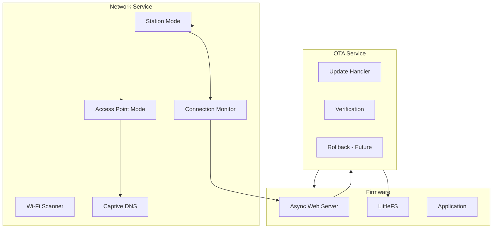
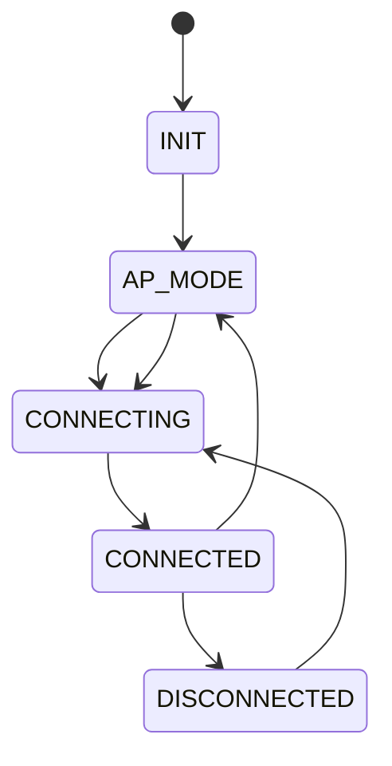
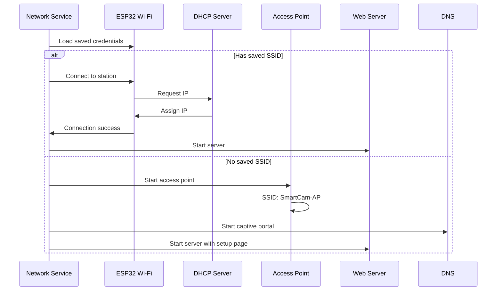
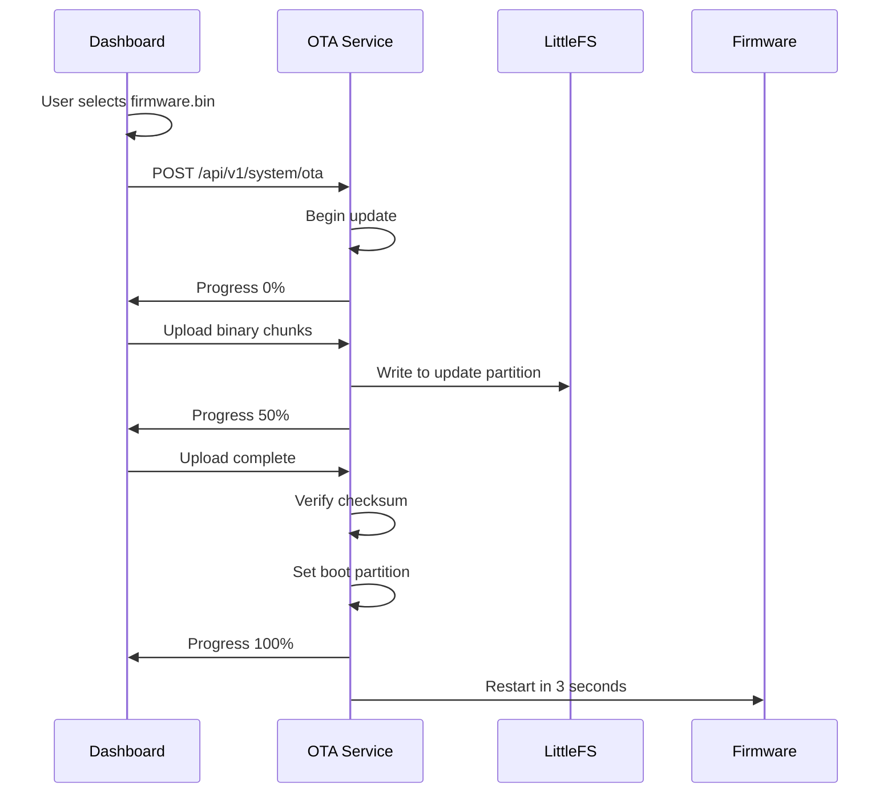

# SmartCam Platform — Network and OTA

## Objective

Define the Network Service and OTA Update Service, responsible for Wi-Fi connectivity, access point mode, network scanning, and over-the-air firmware updates.

## Scope

This document covers Wi-Fi connection management (STA + AP), network scanning, DHCP/static IP configuration, hostname resolution, connection monitoring, and OTA firmware update protocol.

## Architecture



## Components

### Wi-Fi Modes



### Wi-Fi Configuration

```json
{
    "mode": "STA",
    "ssid": "HomeNetwork",
    "password": "",
    "hostname": "smartcam-os",
    "ip_mode": "dhcp",
    "ip": "",
    "gateway": "",
    "subnet": "",
    "dns": "",
    "ap_ssid": "SmartCam-AP",
    "ap_password": "smartcam123"
}
```

## Fluxos

### Connection Flow



### OTA Update Flow



## Interfaces

### Network Service API

```cpp
class NetworkService {
public:
    Result begin();
    Result connect(const String& ssid, const String& password);
    Result disconnect();
    Result startAP(const String& ssid, const String& password);
    Result scanNetworks(Vector<NetworkInfo>& networks);
    Result setStaticIP(const String& ip, const String& gateway, const String& subnet);
    Result setHostname(const String& hostname);
    bool isConnected();
    String getIP();
    String getSSID();
    int8_t getRSSI();
    NetworkConfig getConfig();
};
```

### OTA Service API

```cpp
class OTAService {
public:
    Result begin();
    Result startUpdate(size_t firmwareSize);
    Result writeChunk(const uint8_t* data, size_t length);
    Result finishUpdate();
    Result abortUpdate();
    float getProgress();
    OTAStatus getStatus();
    bool isInProgress();

    // Callbacks
    void onProgress(std::function<void(float)> callback);
    void onError(std::function<void(int)> callback);
};
```

## Estrutura de Pastas

```text
firmware/
    network/
        network_service.h
        network_service.cpp
        wifi_manager.h
        wifi_manager.cpp
        wifi_scanner.h
        wifi_scanner.cpp
        captive_portal.h
        captive_portal.cpp
    ota/
        ota_service.h
        ota_service.cpp
        ota_handler.h
        ota_handler.cpp
```

## Responsabilidades

| Component | Responsibility |
|-----------|----------------|
| Network Service | Public API, mode switching, configuration |
| Wi-Fi Manager | Connection, reconnection, AP mode |
| Wi-Fi Scanner | Network scan with RSSI and security info |
| Captive Portal | DNS redirect for first-time setup |
| OTA Service | Firmware update lifecycle |
| OTA Handler | Partition management, checksum verification |

## Requisitos

| ID | Requirement |
|----|-------------|
| NET-001 | Auto-connect to last known Wi-Fi network on boot |
| NET-002 | Fall back to AP mode if no saved credentials exist |
| NET-003 | AP mode SSID: "SmartCam-AP" with captive portal |
| NET-004 | Support static IP and DHCP configuration |
| NET-005 | Automatic reconnection with exponential backoff |
| NET-006 | Hostname configuration (default: "smartcam-os") |
| NET-007 | Wi-Fi scan returns SSID, RSSI, encryption type, channel |
| OTA-001 | Update firmware via HTTP upload |
| OTA-002 | Progress reporting via WebSocket |
| OTA-003 | Firmware validation with SHA-256 checksum |
| OTA-004 | Preserve configuration across OTA updates |
| OTA-005 | Abort safety: invalid firmware does not apply |
| OTA-006 | Update progress accessible from Dashboard |

## Considerações

The Network Service handles two distinct scenarios: configured (STA mode) and first-time setup (AP mode with captive portal). The automatic fallback ensures the device is always accessible on the network, even after configuration loss or network changes. The OTA Service is designed for reliability: firmware is verified before application, and the update partition is marked only after successful checksum validation.

## Próximos documentos relacionados

- [11-dashboard-web.md](11-dashboard-web.md) — OTA and network configuration pages
- [12-api-rest-websocket.md](12-api-rest-websocket.md) — Network and OTA API endpoints
- [13-configuration-manager.md](13-configuration-manager.md) — Wi-Fi credential storage
