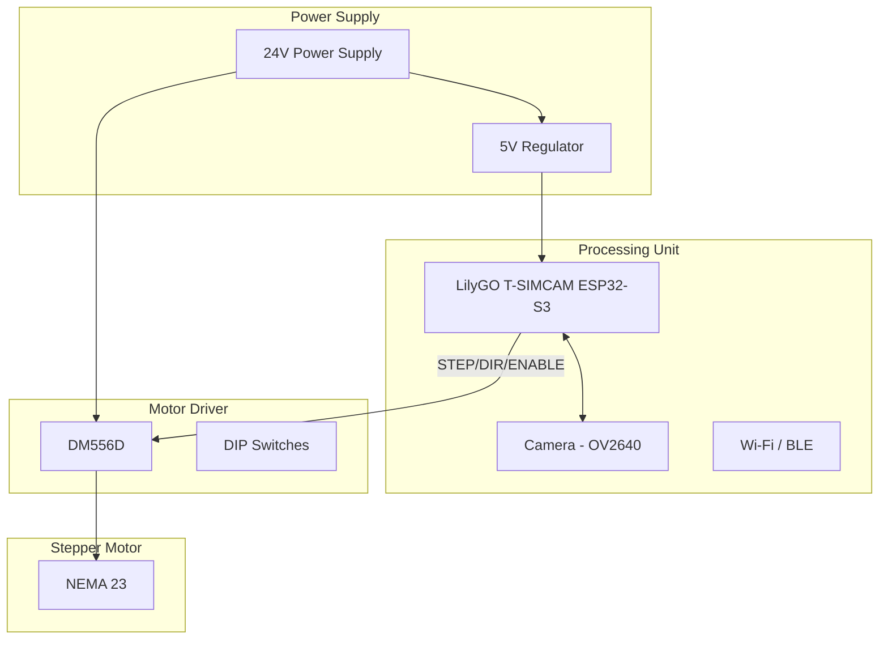

# SmartCam Platform — Hardware Reference

## Objective

Define the official hardware platform for the SmartCam Platform, including the LilyGO T-SIMCAM ESP32-S3, DM556D stepper driver, stepper motor, electrical connections, and GPIO mapping.

## Scope

This document covers the processing unit specifications, supported peripherals, GPIO allocation, power supply requirements, wiring diagrams, and expansion provisions.

## Architecture



## Components

### Processing Unit

| Parameter | Specification |
|-----------|--------------|
| Model | LilyGO T-SIMCAM ESP32-S3 V1.6 |
| SoC | ESP32-S3 |
| Architecture | Xtensa Dual-Core 32-bit |
| Clock Speed | 240 MHz |
| Wi-Fi | 2.4 GHz 802.11 b/g/n |
| Bluetooth | BLE 5.0 |
| Flash | 16 MB |
| PSRAM | 8 MB (Quad SPI) |
| Camera Interface | FPC 24-pin |
| Power Input | USB-C or 5V external |

### Camera

| Parameter | Specification |
|-----------|--------------|
| Primary Sensor | OV2640 |
| Interface | 8-bit DVP + SCCB |
| Max Resolution | 1600 x 1200 (UXGA) |
| Supported Resolutions | QQVGA, QVGA, VGA, SVGA, XGA |
| FOV | 66° (adjustable with lens) |

### Motor Driver

| Parameter | Specification |
|-----------|--------------|
| Model | DM556D |
| Type | Digital Stepper Driver |
| Input Voltage | 24V - 48V DC |
| Output Current | 1.0 - 5.6 A (configurable) |
| Microstep | 1 - 128 (configurable via DIP) |
| Control Signal | STEP + DIR + ENABLE (3.3V compatible) |
| Protection | Over-current, over-voltage, short circuit |

### Stepper Motor

| Parameter | Specification |
|-----------|--------------|
| Type | NEMA 23 (configurable for NEMA 17/24/34) |
| Step Angle | 1.8° (200 steps/rev) |
| Wiring | Bipolar 4-wire |

## Fluxos

### Electrical Connection

```text
ESP32-S3                    DM556D
--------                    ------
GPIO_STEP  --------------- PUL+
GPIO_DIR   --------------- DIR+
GPIO_ENABLE --------------- ENA+
GND        --------------- PUL-
GND        --------------- DIR-
GND        --------------- ENA-

DM556D                     Motor
------                     -----
A+        --------------- A+
A-        --------------- A-
B+        --------------- B+
B-        --------------- B-

Power:
24V PSU  (+) ------- DM556D Power+
24V PSU  (-) ------- DM556D Power-
5V Regulator -------- ESP32 5V pin
```

### GPIO Allocation

| Function | GPIO | Notes |
|----------|------|-------|
| STEP | TBD | Hardware timer output |
| DIR | TBD | Direction control |
| ENABLE | TBD | Driver enable |
| Camera DVP | Various | Occupied by camera FPC connector |
| LED Status | TBD | System status indicator |
| BOOT Button | GPIO0 | Internal |
| Sensor Input | TBD | Limit switch / home sensor |

**Note:** TBD values must be confirmed from the T-SIMCAM V1.6 schematic to avoid conflicts with camera DVP pins and PSRAM.

## Interfaces

### DM556D DIP Switch Configuration

| SW | Function | ON | OFF |
|----|----------|----|-----|
| SW1-3 | Microstep selection | See table below |
| SW4-6 | Current selection | See driver manual |
| SW7 | Enable low-pass filter | Filter on | Filter off |
| SW8 | Self-test | Self-test | Normal |

### Microstep Table (SW1-SW3)

| SW1 | SW2 | SW3 | Microstep | Steps/Rev |
|-----|-----|-----|-----------|-----------|
| ON | ON | ON | 1 | 200 |
| ON | ON | OFF | 2 | 400 |
| ON | OFF | ON | 4 | 800 |
| ON | OFF | OFF | 8 | 1600 |
| OFF | ON | ON | 16 | 3200 |
| OFF | ON | OFF | 32 | 6400 |
| OFF | OFF | ON | 64 | 12800 |
| OFF | OFF | OFF | 128 | 25600 |

## Estrutura de Pastas

```text
hardware/
    schematics/
        tsincam_pinout.pdf
        dm556d_connection.pdf
        power_supply.pdf
    pcb/
        expansion_board/
    pinout/
        tsincam_pinout.csv
        dm556d_pinout.csv
    datasheets/
        ESP32-S3.pdf
        OV2640.pdf
        DM556D.pdf
    bom/
        bom_v1.0.csv
    cad/
        step/
        stl/
        fusion360/
```

## Responsabilidades

| Component | Responsibility |
|-----------|----------------|
| T-SIMCAM ESP32-S3 | Main processing, Wi-Fi, camera interface |
| DM556D | Stepper motor current control and microstepping |
| NEMA 23 | Physical rotation (PAN axis) |
| Power Supply | 24V for driver, regulated 5V for ESP32 |
| Wiring | STEP/DIR/ENABLE signal integrity |

## Requisitos

| ID | Requirement |
|----|-------------|
| HWR-001 | ESP32-S3 operates at 240 MHz with PSRAM enabled |
| HWR-002 | GPIOs are never hardcoded — defined in config.h |
| HWR-003 | Driver accepts 3.3V logic signals (verify with hardware) |
| HWR-004 | Common ground between ESP32 and DM556D |
| HWR-005 | Motor is powered exclusively by DM556D, never by ESP32 |
| HWR-006 | Camera FPC connector is fully seated before power-on |
| HWR-007 | Antenna is connected for Wi-Fi operation |
| HWR-008 | Power supply polarity is verified before energizing |

## Considerações

The GPIO allocation table requires final validation against the T-SIMCAM V1.6 schematic to ensure no conflicts with the camera DVP interface (which occupies a significant number of GPIOs) or the PSRAM quad-SPI interface. The expansion header should reserve pins for future Tilt axis control, home/limit sensors, and an I2C bus for external sensors.

## Próximos documentos relacionados

- [01-introduction.md](01-introduction.md) — Project overview and hardware scope
- [05-motion-engine.md](05-motion-engine.md) — Motor control and axis configuration
- [04-camera-engine.md](04-camera-engine.md) — Camera initialization and streaming
