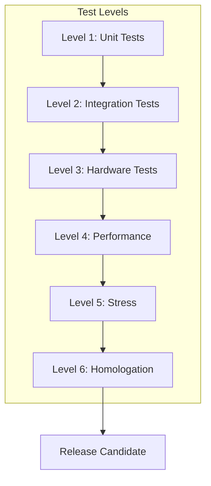
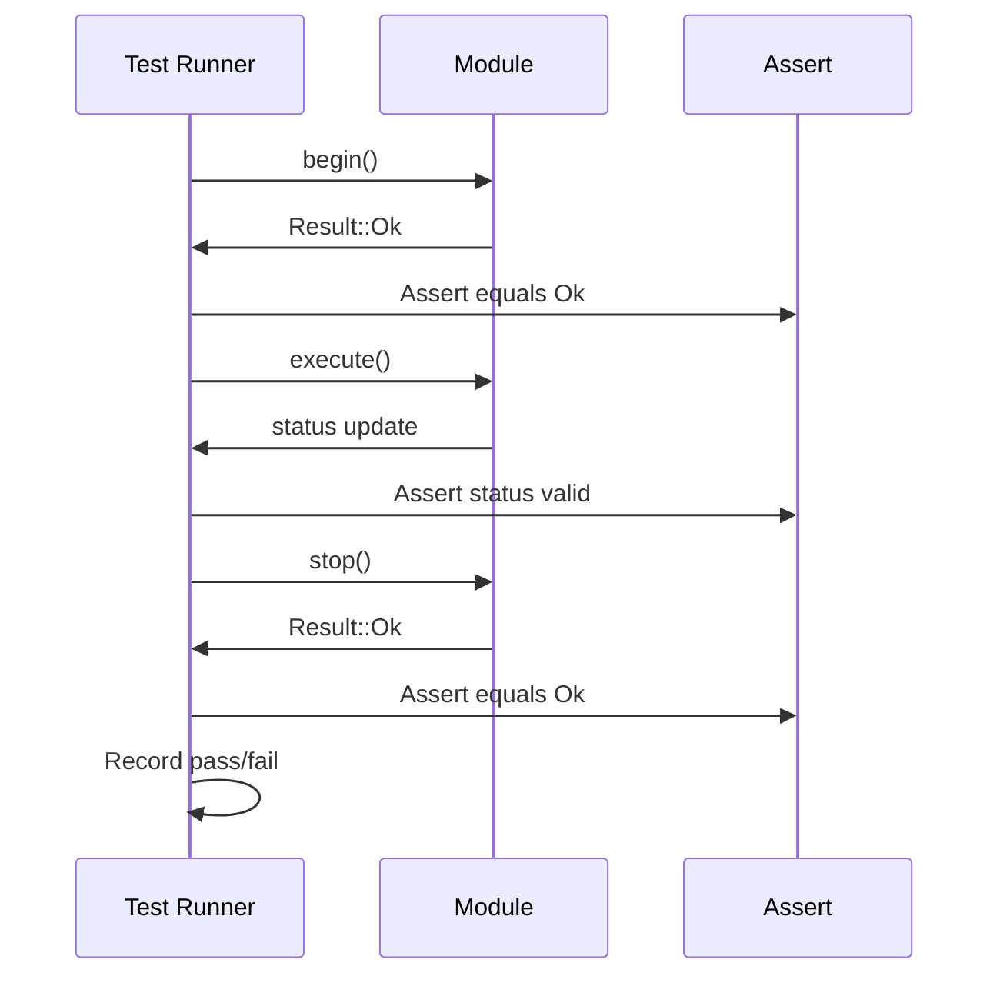

# SmartCam Platform — Master Test Plan

## Objective

Define the comprehensive testing strategy for validating every module of the SmartCam Platform. A release is only published when all tests pass at every defined level.

## Scope

This document covers unit tests, integration tests, hardware tests, performance benchmarks, stress tests, dashboard validation, API testing, and the release qualification process.

## Architecture



## Components

### Unit Test Matrix

| Module | Tests | Pass Criteria |
|--------|-------|---------------|
| Camera Engine | Init, capture, config, restart | 100% |
| Motion Engine | Move, stop, home, limits, speed | 100% |
| Tracking Engine | Target selection, PID, dead zone, loss | 100% |
| Vision Engine | Filters, colors, blob, measure | 100% |
| AI Engine | Load model, infer, unload | 100% |
| Storage Service | Save, load, delete, format | 100% |
| Logger Service | All 6 levels, ring buffer, export | 100% |
| Network Service | Connect, disconnect, scan, AP mode | 100% |

### Hardware Test Matrix

| Test | Method | Duration | Pass Criteria |
|------|--------|----------|---------------|
| Camera FPS | Capture at QVGA | 60 seconds | Min 15 FPS |
| Camera Image Quality | Visual inspection | — | No artifacts |
| Motor Step Accuracy | Move 10000 steps | — | ±1 step |
| Motor Continuous | Run at 200 RPM | 1 hour | No lost steps |
| Motor Temperature | Thermal measurement | 1 hour | Below 60°C |
| Wi-Fi Range | RSSI measurement | Various distances | RSSI > -75 dBm at 10m |
| OTA Update | Upload firmware | Test file | 100% success |
| System Reboot | Power cycle | 100 cycles | 100% boot success |

## Fluxos

### Automated Test Sequence



### Self-Test Sequence (Boot)

```text
Power on
    |
    v
PSRAM test
    |
    v
Flash test
    |
    v
Camera sensor detection
    |
    v
Camera frame capture test
    |
    v
Motor driver communication
    |
    v
Wi-Fi module check
    |
    v
[All pass] --> READY
    |
[Failure] --> Dashboard displays error with code
```

## Interfaces

### Test Results Structure

```cpp
struct TestResult {
    String testId;        // e.g., "CAM-001"
    String module;        // "camera"
    String description;
    bool passed;
    float durationMs;
    String errorMessage;
};
```

### Test Suite API

```cpp
class TestSuite {
public:
    // Registration
    void registerTest(const String& id, std::function<bool()> test);

    // Execution
    bool runAll();
    bool runModule(const String& module);
    bool runTest(const String& id);

    // Results
    void getResults(Vector<TestResult>& results);
    int getPassCount();
    int getFailCount();
    int getTotalCount();

    // Reporting
    String generateReport();
};
```

## Estrutura de Pastas

```text
tests/
    unit/
        test_camera.cpp
        test_motion.cpp
        test_tracking.cpp
        test_vision.cpp
        test_ai.cpp
        test_storage.cpp
        test_logger.cpp
        test_network.cpp
        test_config.cpp
    integration/
        test_camera_motion.cpp
        test_tracking_vision.cpp
        test_api_endpoints.cpp
        test_websocket_events.cpp
    hardware/
        test_hardware_camera.cpp
        test_hardware_motor.cpp
        test_hardware_wifi.cpp
        test_hardware_stress.cpp
    performance/
        bench_camera_fps.cpp
        bench_ai_inference.cpp
        bench_motion_latency.cpp
    stress/
        stress_24h.cpp
        stress_72h.cpp
        stress_7d.cpp
```

## Responsabilidades

| Test Level | Responsibility | Who Executes |
|------------|---------------|--------------|
| Unit | Module isolation testing | Developer |
| Integration | Cross-module interaction | Developer |
| Hardware | Physical device validation | QA / Engineer |
| Performance | Timing and resource measurement | Developer |
| Stress | Long-duration stability | QA |
| Homologation | Full release qualification | Project Lead |

## Requisitos

| ID | Requirement |
|----|-------------|
| TST-001 | All unit tests pass before merge to develop |
| TST-002 | All integration tests pass before release branch |
| TST-003 | Hardware tests pass on actual T-SIMCAM hardware |
| TST-004 | No memory leaks detected during 72-hour stress test |
| TST-005 | System remains stable for 7+ days without restart |
| TST-006 | API responses are validated for format and status codes |
| TST-007 | Dashboard renders correctly in Chrome, Edge, Firefox |
| TST-008 | OTA update preserves all configuration settings |
| TST-009 | 100 consecutive boots without failure |
| TST-010 | Test report is generated with each release |

## Considerações

Testing on ESP32-S3 requires specialized approaches due to limited resources. Unit tests for algorithmic modules (PID, filters, geometry) can run on a development PC with test vectors. Hardware-dependent tests require the actual T-SIMCAM assembly. Stress tests must be automated with watchdog monitoring — if the device hangs during a 7-day test, the test logs should capture the time and state preceding the failure.

## Próximos documentos relacionados

- [19-github-repository.md](19-github-repository.md) — CI/CD pipeline and test automation
- [20-roadmap.md](20-roadmap.md) — Release milestones and qualification gates
- [17-coding-standard.md](17-coding-standard.md) — Code quality requirements for testability
