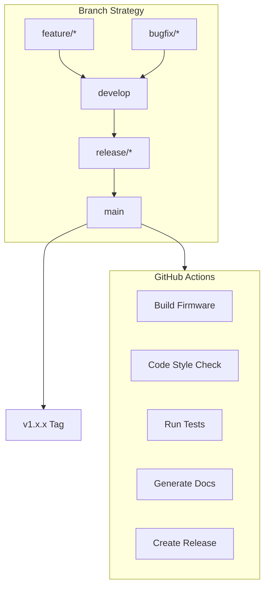
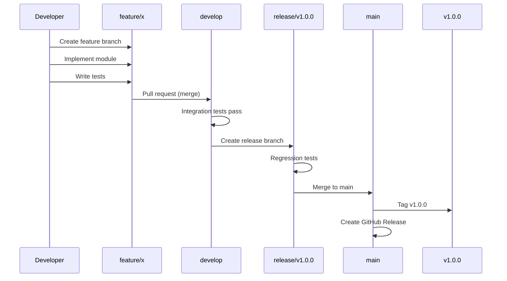

# SmartCam Platform — GitHub Repository

## Objective

Define the official GitHub repository structure, branching strategy, release workflow, issue templates, and contribution guidelines for the SmartCam Platform.

## Scope

This document covers the repository folder layout, Git Flow conventions, semantic versioning, release packaging, CI/CD pipeline planning, issue management, and licensing.

## Architecture



## Components

### Repository Structure

```text
smartcam-os/
    .github/
        ISSUE_TEMPLATE/
            bug_report.md
            feature_request.md
            documentation.md
            hardware_issue.md
        PULL_REQUEST_TEMPLATE/
            pull_request_template.md
        workflows/
            build.yml
            lint.yml
            release.yml
    assets/
        logos/
        screenshots/
        diagrams/
        videos/
    docs/                    # Official documentation
        01-introduction.md
        02-system-architecture.md
        ...
        20-roadmap.md
    firmware/                # SmartCam OS firmware
        SmartCamOS.ino
        core/
            camera/
            vision/
            tracking/
            motion/
            ai/
        network/
        storage/
        logger/
        api/
        config/
        dashboard/
        utils/
    sdk/                     # SmartCam SDK
        core/
        interfaces/
        events/
        services/
        modules/
        context/
    web/                     # SmartCam Dashboard
        index.html
        css/
        js/
        widgets/
        plugins/
    hardware/                # Hardware documentation
        schematics/
        pcb/
        pinout/
        datasheets/
        bom/
    cad/                     # 3D mechanical models
        step/
        stl/
        fusion360/
    examples/                # Example applications
        PersonTracker/
        CameraTest/
        MotionTest/
        VisionTest/
        OTA/
    tests/                   # Test suites
        unit/
        integration/
        hardware/
        performance/
        stress/
    tools/                   # Development utilities
        image_converter/
        benchmark/
        dataset_tools/
        calibration/
    scripts/                 # Automation scripts
        build/
        release/
        backup/
        documentation/
    .gitignore
    CHANGELOG.md
    CONTRIBUTING.md
    CODE_OF_CONDUCT.md
    SECURITY.md
    LICENSE
    README.md
    ROADMAP.md
```

### Naming Convention

| Element | Convention | Example |
|---------|------------|---------|
| Repository | `smartcam-os` | github.com/user/smartcam-os |
| Main Branch | `main` | |
| Development | `develop` | |
| Feature | `feature/*` | `feature/vision-engine` |
| Bugfix | `bugfix/*` | `bugfix/camera-timeout` |
| Release | `release/*` | `release/v1.0.0` |
| Tags | `vMAJOR.MINOR.PATCH` | `v1.2.3` |

## Fluxos

### Git Flow



### Release Packaging

Each GitHub Release includes:

```text
smartcam-os-v1.0.0.zip
    |
    +-- firmware/
    |   +-- SmartCamOS-v1.0.0.bin
    |   +-- SmartCamOS-v1.0.0.ino.factory
    +-- web/
    |   +-- dashboard-v1.0.0.zip
    +-- docs/
    |   +-- architecture-book-v1.0.0.pdf
    +-- RELEASE_NOTES.md
    +-- SHA256SUMS.txt
```

## Interfaces

### Issue Templates

#### Bug Report

```markdown
---
name: Bug Report
about: Report a bug to help improve SmartCam OS
title: '[BUG] '
labels: bug
---

**Hardware:** [e.g., T-SIMCAM v1.6]
**Firmware Version:** [e.g., v1.0.0]
**Dashboard Version:** [e.g., v1.0.0]

**Description:**
Clear description of the bug.

**Steps to Reproduce:**
1. Go to '...'
2. Click on '....'
3. See error

**Expected Behavior:**
What should happen.

**Actual Behavior:**
What actually happens.

**Logs:**
Relevant log output.
```

#### Feature Request

```markdown
---
name: Feature Request
about: Suggest an idea for SmartCam OS
title: '[FEATURE] '
labels: enhancement
---

**Is your feature request related to a problem?**
Description of the problem.

**Proposed Solution:**
What should be implemented.

**Alternative Solutions:**
Any alternatives considered.

**Additional Context:**
Screenshots, diagrams, references.
```

### Pull Request Template

```markdown
## Description
What does this PR change?

## Type of Change
- [ ] Bug fix
- [ ] New feature
- [ ] Breaking change
- [ ] Documentation update

## Testing
- [ ] Unit tests pass
- [ ] Integration tests pass
- [ ] Hardware tests pass
- [ ] Manual testing on T-SIMCAM

## Checklist
- [ ] Code follows Coding Standard (COD-001 to COD-012)
- [ ] Doxygen comments added
- [ ] No delay() usage
- [ ] No Serial.println() - uses Logger
- [ ] No hardcoded GPIOs
- [ ] Error handling with Result type
- [ ] CHANGELOG updated
- [ ] Documentation updated
```

## Estrutura de Pastas

```text
.github/
    ISSUE_TEMPLATE/
        bug_report.md
        feature_request.md
        documentation.md
        hardware_issue.md
    PULL_REQUEST_TEMPLATE/
        pull_request_template.md
    workflows/
        build.yml
        lint.yml
        test.yml
        release.yml
        docs.yml
```

## Responsabilidades

| Role | Responsibility |
|------|----------------|
| Maintainer | Review PRs, manage releases, maintain roadmap |
| Contributor | Follow Git Flow, pass CI checks, update docs |
| CI/CD | Build firmware, run lint, execute tests, generate docs |

## Requisitos

| ID | Requirement |
|----|-------------|
| REPO-001 | main branch is always stable and releasable |
| REPO-002 | All merges require passing CI checks |
| REPO-003 | Feature branches branch from develop and merge back to develop |
| REPO-004 | Release branches are created from develop when feature-complete |
| REPO-005 | Every release is tagged with semantic version |
| REPO-006 | CHANGELOG follows Keep a Changelog format |
| REPO-007 | LICENSE is MIT |
| REPO-008 | Pull requests require code review approval |
| REPO-009 | GitHub Actions build firmware on push and PR |
| REPO-010 | Release assets include firmware binary, web interface, and docs |

## Considerações

The single-repository approach keeps all platform components together during initial development. If the application ecosystem grows significantly, the repository can be split into `smartcam-platform` (meta-repo), `smartcam-os` (firmware), `smartcam-apps` (applications), and `smartcam-hardware` (schematics/CAD) in the future. The MIT license is chosen to maximize adoption and contributions.

## Próximos documentos relacionados

- [18-test-plan.md](18-test-plan.md) — Test-driven CI pipeline
- [20-roadmap.md](20-roadmap.md) — Release milestones
- [17-coding-standard.md](17-coding-standard.md) — Code review checklist
