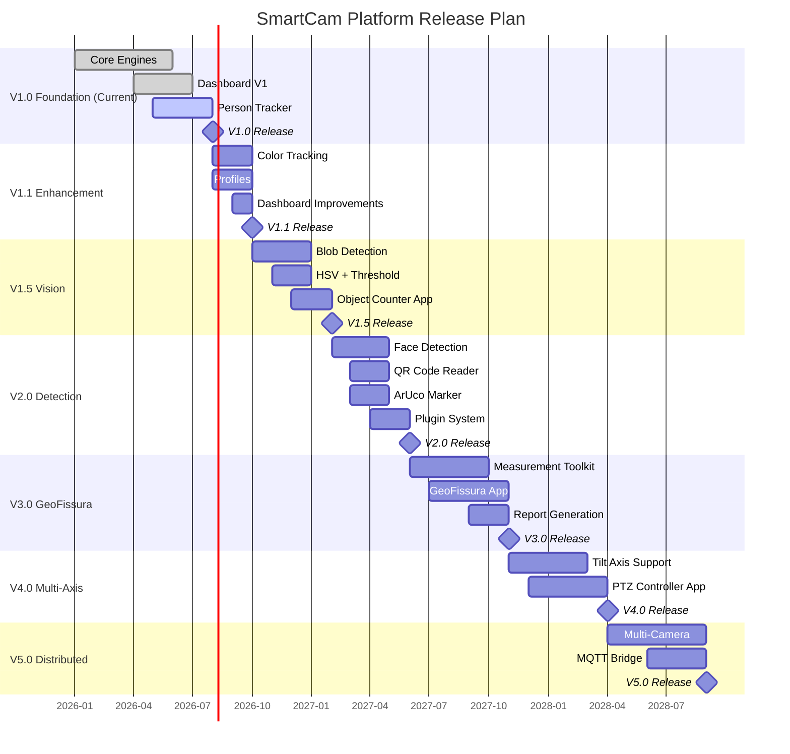

# SmartCam Platform — Roadmap

## Objective

Define the official development roadmap for the SmartCam Platform across major and minor versions. Each release is a fully functional, tested, and documented milestone.

## Scope

This document covers version planning from V1.0 to V5.0, application release timeline, hardware evolution, SDK maturity, API versioning, and the release qualification criteria.

## Architecture

```mermaid
flowchart LR
    subgraph V1 [V1.0 - Foundation]
        V1C[Core Engines]
        V1D[Dashboard]
        V1A[Person Tracker]
    end

    subgraph V2 [V2.0 - Detection]
        V2F[Face + QR + ArUco]
        V2P[Plugins]
        V2S[SDK 2.0]
    end

    subgraph V3 [V3.0 - Measurement]
        V3G[GeoFissura]
        V3M[Measurement Toolkit]
        V3T[Time Lapse]
    end

    subgraph V4 [V4.0 - Multi-Axis]
        V4P[Pan + Tilt + Zoom]
        V4PTZ[PTZ Controller]
    end

    subgraph V5 [V5.0 - Distributed]
        V5C[Multi-Camera Cluster]
        V5Q[MQTT + Cloud]
    end

    V1 --> V2 --> V3 --> V4 --> V5
```



## Components

### Version Timeline



### Application Release Matrix

| Application | V1.0 | V1.1 | V1.5 | V2.0 | V3.0 | V4.0 | V5.0 |
|-------------|------|------|------|------|------|------|------|
| Person Tracker | ✓ | ✓ | ✓ | ✓ | ✓ | ✓ | ✓ |
| Color Tracker | | ✓ | ✓ | ✓ | ✓ | ✓ | ✓ |
| Object Counter | | | ✓ | ✓ | ✓ | ✓ | ✓ |
| Face Tracker | | | | ✓ | ✓ | ✓ | ✓ |
| QR Code Reader | | | | ✓ | ✓ | ✓ | ✓ |
| ArUco Marker | | | | ✓ | ✓ | ✓ | ✓ |
| GeoFissura | | | | | ✓ | ✓ | ✓ |
| Time Lapse | | | | | ✓ | ✓ | ✓ |
| Inspection Toolkit | | | | | ✓ | ✓ | ✓ |
| PTZ Controller | | | | | | ✓ | ✓ |
| Multi-Camera | | | | | | | ✓ |

### SDK Evolution

```text
SDK V1.0 (V1.0 release)
    Base classes: SmartCamObject, SmartCamModule, SmartCamService, SmartCamApp
    Event Bus with publish/subscribe
    Configuration Manager
    Logger Service

SDK V2.0 (V2.0 release)
    Plugin system for hot-swappable detectors
    Extended SmartCamApp interface
    Application lifecycle hooks

SDK V3.0 (V3.0 release)
    Measurement framework
    Report generator interface
    Calibration toolkit
```

### Dashboard Evolution

```text
Dashboard V1 (V1.0)
    Core pages: Dashboard, Camera, Motion, Tracking, Logs, Settings, OTA
    Real-time WebSocket updates
    Dark/light theme

Dashboard V2 (V2.0)
    Widget system
    Plugin pages for applications
    Drag-and-drop layout

Dashboard V3 (V3.0)
    GeoFissura measurement interface
    Historical data charts
    Report viewer

Dashboard V4 (V4.0)
    PTZ control interface
    Multi-axis visualization

Dashboard V5 (V5.0)
    Multi-camera grid view
    Network management interface
```

## Fluxos

### Release Qualification

Each version passes through this gate before release:

```text
All unit tests pass
    |
    v
All integration tests pass
    |
    v
Hardware tests pass (T-SIMCAM + DM556D)
    |
    v
72-hour stress test without failure
    |
    v
API backward compatibility verified
    |
    v
Dashboard renders correctly (Chrome, Edge, Firefox, Safari)
    |
    v
Documentation fully updated
    |
    v
CHANGELOG complete
    |
    v
Release tag created
    |
    v
Release assets published on GitHub
```

## Interfaces

### Version String Format

```text
MAJOR.MINOR.PATCH

MAJOR: Breaking API or architectural changes
MINOR: New features, backward compatible
PATCH: Bug fixes, no new features
```

Example progression: `v1.0.0` → `v1.0.1` → `v1.1.0` → `v2.0.0`

## Estrutura de Pastas

```text
/docs
    01-introduction.md
    02-system-architecture.md
    03-core-architecture.md
    04-camera-engine.md
    05-motion-engine.md
    06-vision-engine.md
    07-ai-engine.md
    08-tracking-engine.md
    09-behavior-engine.md
    10-sdk-framework.md
    11-dashboard-web.md
    12-api-rest-websocket.md
    13-configuration-manager.md
    14-storage-logger.md
    15-network-ota.md
    16-hardware-reference.md
    17-coding-standard.md
    18-test-plan.md
    19-github-repository.md
    20-roadmap.md
```

## Responsabilidades

| Version | Primary Focus | Target Date |
|---------|--------------|-------------|
| V1.0 | Foundation: Core + Dashboard + Person Tracker | 2026 Q3 |
| V1.1 | Enhancement: Color tracking, profiles | 2026 Q4 |
| V1.5 | Vision: Computer vision algorithms | 2027 Q1 |
| V2.0 | Detection: Face, QR, ArUco, plugins | 2027 Q2 |
| V3.0 | Measurement: GeoFissura, measurement toolkit | 2027 Q4 |
| V4.0 | Multi-Axis: PTZ, dual-axis motion | 2028 Q2 |
| V5.0 | Distributed: Multi-camera, MQTT, cloud | 2028 Q3 |

## Requisitos

| ID | Requirement |
|----|-------------|
| RDM-001 | Each major version is fully functional before next begins |
| RDM-002 | SDK API remains backward compatible within MAJOR version |
| RDM-003 | Dashboard V1 works with all V1.x firmware |
| RDM-004 | Every release passes full test suite |
| RDM-005 | Application plugins from earlier versions work on later versions |
| RDM-006 | Hardware evolution is backward compatible with existing firmware |
| RDM-007 | Documentation is updated with each release |
| RDM-008 | Migration path is documented for MAJOR version upgrades |

## Considerações

The roadmap prioritizes a solid foundation before adding advanced features. V1.0 focuses on making the core platform reliable with a single application (Person Tracker). V2.0 expands detection capabilities. V3.0 introduces measurement — the foundation for GeoFissura. V4.0 adds mechanical complexity with multi-axis control. V5.0 scales horizontally with distributed cameras. Each version builds on the previous one without requiring rewrites.

## Próximos documentos relacionados

- [01-introduction.md](01-introduction.md) — Project overview
- [19-github-repository.md](19-github-repository.md) — Release workflow
- [18-test-plan.md](18-test-plan.md) — Release qualification criteria
